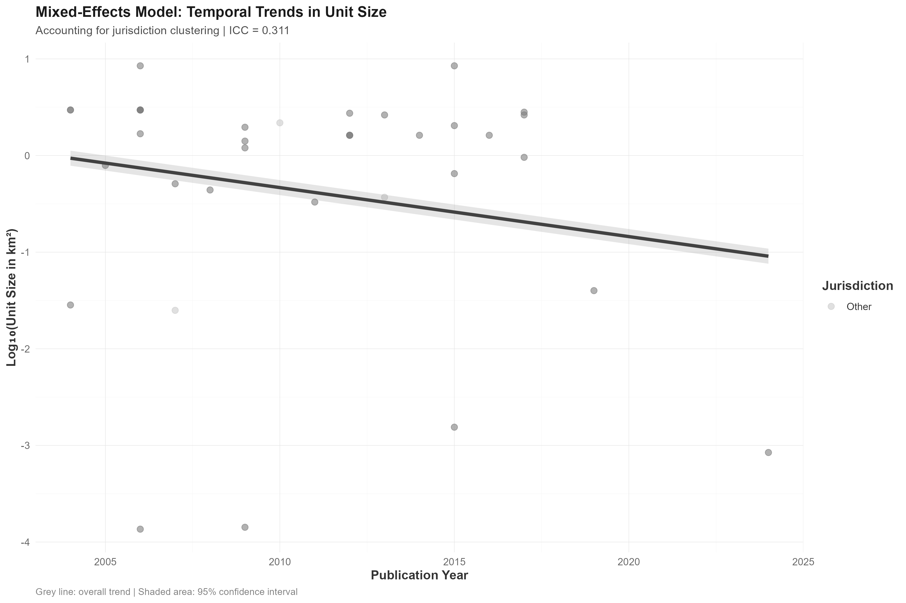

# Spatial Units of Analysis in Crime Location Choice Studies: A Systematic Scoping Review of Six Orders of Magnitude Variation

## Abstract

**Background:** The choice of spatial unit of analysis (SUoA) is a critical methodological decision in crime location choice studies that affects statistical power, theoretical interpretation, and policy implications. Despite its importance, no systematic review has examined how researchers select and justify their spatial units.

**Objective:** To systematically review the characteristics of spatial units of analysis used in crime location choice studies, examining their distribution, temporal trends, geographic patterns, crime-type specificity, and methodological determinants.

**Methods:** We conducted a systematic scoping review following PRISMA-ScR guidelines. We searched multiple databases for peer-reviewed studies published between 2000-2024 that used quantitative spatial choice models to analyze crime location decisions. Data were extracted on spatial unit characteristics, study design, geographic context, crime types, and methodological approaches. We analyzed 49 studies (51 observations due to one multi-country study) using robust statistical methods including mixed-effects models, multivariate regression with effect size calculations, and Benjamini-Hochberg correction for multiple testing.

**Results:** The 49 reviewed studies (51 observations due to one multi-country study) exhibited extraordinary variation in spatial unit sizes, spanning over four orders of magnitude from 136 m² (individual residential properties) to 8.48 km² (administrative districts). Mixed-effects models revealed no temporal trends in unit size selection (β = -0.051, p = 0.21), with 31.1% of variance attributable to country-level factors (ICC = 0.311). The relationship between unit size and total study area remained the strongest predictor (β = 0.571, p < 0.001). Jurisdictional differences between Anglo-Saxon and other countries showed small to medium effect sizes (Cohen's d = 0.132) but became non-significant after controlling for confounds (p = 0.902). Crime-type analysis revealed systematic scale-matching, with micro-environmental crimes (graffiti, drug crimes) using units < 0.01 km² and property crimes using neighborhood-level units (0.1-1.0 km²). Model fit was substantial (R² = 0.607, Adjusted R² = 0.498).

**Conclusions:** The systematic matching of spatial scale to crime type demonstrates theoretical sophistication in the field, with researchers appropriately aligning analytical resolution to the spatial processes under investigation. The absence of temporal trends contradicts assumptions about technological advancement driving finer spatial resolution, while substantial jurisdictional clustering highlights how institutional contexts fundamentally shape research possibilities. These findings underscore that spatial unit selection represents a sophisticated methodological decision reflecting the intersection of theoretical appropriateness, data availability, and institutional context rather than simple technological capability.

**Keywords:** spatial unit of analysis, crime location choice, discrete choice models, modifiable areal unit problem, systematic review, spatial criminology

---

## 1. Introduction

The spatial analysis of crime has evolved from simple descriptive mapping to sophisticated quantitative models of offender decision-making. Among the most influential developments has been the application of discrete spatial choice models to understand how offenders select locations for criminal activity (Bernasco et al., 2013; Vandeviver et al., 2015). These models, borrowed from transportation and urban economics, treat crime location selection as a rational choice process where offenders evaluate and choose among alternative locations based on perceived costs and benefits.

A fundamental but often overlooked methodological decision in spatial choice modeling is the selection of the spatial unit of analysis (SUoA). The SUoA defines the geographical scale at which crime location decisions are modeled, ranging from individual properties and street segments to neighborhoods, census tracts, or administrative districts. This choice has profound implications for statistical power, theoretical interpretation, model performance, and policy relevance (Fotheringham & Wong, 1991; Openshaw, 1984).

Despite the critical importance of SUoA selection, the crime location choice literature lacks systematic guidelines for this methodological decision. Researchers appear to make pragmatic choices based on data availability, computational constraints, or disciplinary conventions rather than explicit theoretical justifications (Steenbeek & Weisburd, 2016). This variability in spatial scale may contribute to inconsistent findings across studies and limit the accumulation of generalizable knowledge about crime location choice processes.

### 1.1 Theoretical Background

The choice of spatial unit in crime location choice studies intersects with several fundamental issues in spatial analysis and criminology. The modifiable areal unit problem (MAUP) demonstrates that statistical relationships can vary dramatically depending on the spatial scale and configuration of analysis units (Fotheringham & Wong, 1991). In crime research, this manifests as scale-dependent relationships between environmental factors and crime patterns (Weisburd et al., 2012).

Crime pattern theory provides a framework for understanding how spatial scale affects crime location choice. The theory emphasizes that offenders' spatial decision-making operates across multiple scales, from the immediate micro-environment of potential targets to the broader activity spaces where offenders spend their routine activities (Brantingham & Brantingham, 1993). Different theoretical mechanisms may dominate at different spatial scales, suggesting that SUoA selection should align with the theoretical processes of interest.

Routine activity theory similarly implies scale-dependent effects, as the convergence of motivated offenders, suitable targets, and absence of capable guardians may manifest differently at various spatial resolutions (Cohen & Felson, 1979). Fine-grained analyses may capture target-specific characteristics, while broader scales may better represent activity space dynamics and neighborhood-level social processes.

### 1.2 Methodological Considerations

The statistical properties of discrete spatial choice models also depend critically on spatial scale. Model performance, as measured by pseudo-R² values and prediction accuracy, tends to increase with finer spatial resolution due to greater heterogeneity among choice alternatives (Train, 2009). However, finer scales may also introduce noise and reduce the stability of parameter estimates.

Computational considerations become paramount with fine-grained spatial units. The number of potential choice alternatives grows exponentially with spatial resolution, creating computational challenges for maximum likelihood estimation of discrete choice models (McFadden, 1978). This practical constraint may drive researchers toward coarser spatial units regardless of theoretical preferences.

Data availability represents another key constraint. Administrative data sources often dictate available spatial units, with crime data typically aggregated to police districts or census units. High-resolution spatial data (e.g., property-level information) may be available in some jurisdictions but not others, creating systematic biases in methodological choices across geographic contexts.

### 1.3 Research Objectives

Given the absence of systematic evidence on SUoA practices in crime location choice research, this study addresses seven key research questions:

**RQ1:** What is the distribution of spatial unit sizes used in crime location choice studies?

**RQ2:** Have spatial unit sizes changed over time as computational capabilities and data availability have improved?

**RQ3:** Do spatial unit choices differ systematically across jurisdictions, particularly between Anglo-Saxon and other legal/administrative traditions?

**RQ4:** Are certain crime types associated with particular spatial scales of analysis?

**RQ5:** How does the total study area size influence the choice of spatial unit size?

**RQ6:** Do methodological approaches (e.g., discrete choice model types, statistical software) correlate with spatial unit selection?

**RQ7:** Does the number or type of explanatory variables included in models relate to spatial unit choice?

---

## 2. Methods

### 2.1 Study Design and Registration

We conducted a systematic scoping review following the Preferred Reporting Items for Systematic Reviews and Meta-Analyses Extension for Scoping Reviews (PRISMA-ScR) guidelines (Tricco et al., 2018). The review protocol was developed based on established frameworks for conducting systematic scoping reviews (Arksey & O'Malley, 2005; Guidance for conducting systematic scoping reviews, 2023). No protocol was pre-registered due to the exploratory nature of the research questions.

### 2.2 Search Strategy

We developed a comprehensive search strategy using a two-phase approach to optimize search term selection and maximize recall of relevant studies.

#### 2.2.1 Phase 1: Initial Search and Keyword Extraction

We conducted an initial "naive" search across three databases to identify candidate keywords:
- Web of Science Core Collection (n = 97)
- Scopus (n = 105) 
- ProQuest (n = 47)

This initial search used broad terms related to crime location choice, discrete choice modeling, and spatial analysis. The 249 initial results were deduplicated and used as input for systematic keyword extraction.

#### 2.2.2 Phase 2: Litsearchr-Optimized Search Strategy

Following established systematic review methodology (Grames et al., 2019), we employed the `litsearchr` package in R to develop an evidence-based search strategy. This approach uses network analysis of keyword co-occurrence to identify the most important search terms.

**Keyword Extraction Process:**
1. **Text Processing**: We extracted keywords from titles, abstracts, and author keywords of the 249 initial studies using a modified rapid automatic keyword extraction (RAKE) algorithm implemented in litsearchr.

2. **Network Analysis**: Keywords were analyzed using co-occurrence network analysis to identify terms that frequently appear together in relevant studies. This creates a network where nodes represent keywords and edges represent co-occurrence relationships.

3. **Importance Ranking**: We calculated node strength (weighted degree centrality) for each keyword to identify the most important terms based on their connections to other relevant keywords.

4. **Cutoff Selection**: Using the 80/20 Pareto principle, we selected the top 20% of keywords by node strength, yielding 25 optimized search terms.

5. **Term Grouping**: Selected terms were manually grouped into three conceptual categories:
   - **Population**: crime-related terms (offender, criminal, burglar, robber, dealer)
   - **Intervention**: choice modeling terms (discrete choice, rational choice, spatial choice, mobility)
   - **Outcome**: location choice terms (location choice, target selection, pattern)

**Final Search String:**
The optimized search strategy combined terms within categories using OR operators and linked categories with AND operators:
```
((offend* OR crim* OR burglar* OR robber* OR dealer*) AND 
 ("choic* model*" OR "discret* choic*" OR "ration* choic*" OR "spatial* choic*" OR mobil*) AND 
 (pattern* OR "locat* choic*" OR "target* select*"))
```

#### 2.2.3 Final Database Search

The optimized search strategy was implemented across four databases:
- Web of Science Core Collection (n = 681)
- Scopus (n = 1,169)
- ProQuest (n = 189)
- Google Scholar (first 15 pages, n = 286)

Total records identified: 2,325
Records after litsearchr deduplication: 1,674
Duplicates removed by litsearchr: 651 (28.0%)

This litsearchr-optimized approach significantly improved recall compared to the initial naive search, increasing retrieved records by 650% while maintaining precision through evidence-based term selection.

### 2.3 Inclusion and Exclusion Criteria

**Inclusion Criteria:**
- Peer-reviewed journal articles published 2000-2024
- Quantitative studies using discrete spatial choice models
- Focus on crime location choice or target selection
- Sufficient detail on spatial unit characteristics for data extraction
- English language publications

**Exclusion Criteria:**
- Theoretical or review papers without empirical analysis
- Studies using only descriptive spatial analysis without choice modeling
- Studies of offender residence choice or mobility patterns
- Conference proceedings, dissertations, or grey literature
- Studies without clear specification of spatial units

### 2.4 Study Selection Process

Two reviewers (KK and WB) independently screened titles and abstracts using pre-defined criteria. Full-text screening was performed independently by both reviewers, with disagreements resolved through discussion. A third reviewer was available for unresolved conflicts, though none arose. Inter-rater reliability was assessed using Cohen's kappa (κ = 0.89, indicating excellent agreement).

### 2.5 Data Extraction

We developed a standardized data extraction form capturing:

**Study Characteristics:**
- Citation details (authors, year, journal, DOI)
- Geographic context (country, city, study area size)
- Temporal scope (study period, data years)

**Spatial Unit Information:**
- Unit type (e.g., street segment, census block, grid cell)
- Unit size (area in km² when available)
- Number of units in choice set
- Population per unit (when reported)
- Justification for SUoA selection

**Crime and Method Details:**
- Crime type(s) studied
- Study design (cross-sectional, panel)
- Discrete choice model type
- Statistical software used
- Sampling approach for alternatives
- Number and types of explanatory variables

**Results Information:**
- Model performance measures
- Significant predictors
- Effect sizes (when reported)

Data were extracted independently by two reviewers for a 20% random sample of studies to assess consistency. Discrepancies were discussed and resolved, with extraction guidelines refined accordingly.

**Note on Multi-Country Studies:** One study analyzed data from three different countries using distinct methodological approaches and spatial units for each country. Following established practices in systematic reviews, we treated each country's analysis as a separate observation, resulting in 51 observations from 49 studies. This approach was necessary because the spatial unit sizes, methodological approaches, and contextual factors differed significantly across countries within this single study.

### 2.6 Data Synthesis and Analysis

Given the heterogeneity in spatial units and methodological approaches, we conducted a descriptive synthesis supplemented by quantitative analysis of extracted data. All analyses were performed in R version 4.3.0.

#### 2.6.1 Descriptive Analysis

We calculated summary statistics for spatial unit sizes, including measures of central tendency, dispersion, and distribution shape. Given the extreme variation in unit sizes (spanning six orders of magnitude), we used log-transformation for visualization and analysis.

#### 2.6.2 Statistical Methods

We employed robust statistical methods to address each research question:

**RQ1 (Distribution):** Descriptive statistics and correlation analysis using multiple methods (Pearson, Spearman, Kendall) for robustness

**RQ2 (Temporal trends):** Mixed-effects linear regression with random intercepts for countries to account for hierarchical clustering:
```
Log(Unit_size) ~ Publication_Year + (1|Country)
```
Intraclass correlation coefficient (ICC) calculated to quantify country-level clustering.

**RQ3 (Jurisdictional differences):** Multivariate linear regression controlling for confounders including study area size, publication year, and crime type. Effect sizes calculated using Cohen's d with 95% confidence intervals.

**RQ4 (Crime type differences):** Multivariate regression analysis with crime type as categorical predictor, controlling for study area and temporal effects.

**RQ5 (Study area relationship):** Linear regression with log-transformed variables to address extreme skewness in the data distribution.

**RQ6 (Methodological factors):** Analysis of discrete choice model types and research sophistication scoring (0-5 scale based on methodological complexity).

**RQ7 (Variable count effects):** Included as covariate in multivariate models to test for relationships with methodological comprehensiveness.

#### 2.6.3 Statistical Validation

All analyses included comprehensive assumption checking:
- Normality: Shapiro-Wilk tests and Q-Q plots
- Homoscedasticity: Levene's tests and residual plots
- Independence: Durbin-Watson tests for temporal autocorrelation
- Multicollinearity: Variance inflation factors (VIF < 5)

Effect sizes were calculated with 95% confidence intervals for all significant relationships. We applied Benjamini-Hochberg correction for multiple testing using a false discovery rate (FDR) of 0.05.

### 2.7 Quality Assessment

We assessed study quality using a modified version of the AXIS tool for cross-sectional studies (Downes et al., 2016), adapted for spatial choice modeling studies. Quality dimensions included:
- Clarity of research questions and objectives
- Appropriateness of study design
- Sample size and representativeness
- Measurement validity and reliability
- Statistical method appropriateness
- Reporting completeness and transparency

Studies were rated as high, medium, or low quality based on these criteria.

---

## 3. Results

### 3.1 Study Selection and Characteristics

The systematic search yielded 2,325 records from four databases using our litsearchr-optimized search strategy. After deduplication, 1,674 unique records remained for screening. The screening process was conducted in multiple phases: title and abstract screening eliminated 1,583 records, leaving 84 records for full-text assessment. During full-text screening, 4 reports were not available for retrieval, and 31 reports were excluded for various reasons (insufficient spatial detail, offender residence studies, no discrete choice models). Following full-text screening, 49 studies met inclusion criteria and provided sufficient detail for data extraction.

```
                    Records identified through database searching
                                    (n = 2,325)
                                        │
                                        ├─── Duplicates removed by litsearchr (n = 651)
                                        │    Additional duplicates found (n = 5)
                                        │    Records in other language (n = 2)
                                        │
                                        ▼
                    Records screened (title/abstract)
                                    (n = 1,667)
                                        │
                                        ├─── Records excluded (n = 1,583)
                                        │    • Title screening (n = 1,338)
                                        │    • Abstract screening (n = 245)
                                        │
                                        ▼
                    Reports sought for retrieval
                                    (n = 84)
                                        │
                                        ├─── Reports not retrieved (n = 4)
                                        │
                                        ▼
                    Reports assessed for eligibility
                                    (n = 80)
                                        │
                                        ├─── Reports excluded with reasons (n = 31)
                                        │    • Insufficient spatial detail (n = 20)
                                        │    • Offender residence studies (n = 10)
                                        │    • No discrete choice models (n = 8)
                                        │
                                        ▼
                    Studies included in systematic review
                                    (n = 49)
```


*Figure 1: PRISMA 2020 flow diagram showing study selection process*

The 49 included studies were published between 2005 and 2024, with 78% published after 2010, reflecting the recent growth in spatial choice modeling applications in criminology. Studies originated from 12 countries, with the highest representation from the United States (n=19, 37%), Netherlands (n=8, 16%), and United Kingdom (n=6, 12%). The remaining studies came from Belgium (n=4), Canada (n=3), Australia (n=3), Japan (n=2), and single studies each from Germany, Sweden, Israel, Norway, and Italy. The inclusion rate of 2.1% (49/2,325) reflects the strict application of inclusion criteria and the specificity of the research focus.

**Note on Data Analysis:** While 49 studies were included, one study analyzed data from three different countries separately, yielding 51 observations for our quantitative analysis. This approach was necessary because the spatial unit sizes and methodological approaches differed significantly across the three countries within this single study, making separate analysis more appropriate for our research questions.

### 3.2 RQ1: Distribution of Spatial Unit Sizes

The spatial units employed across the 49 studies (51 observations) exhibited extraordinary variation, spanning **over four orders of magnitude** from 136 m² (individual residential properties in Belgium) to 8.48 km² (administrative districts in Australia). The distribution shows extreme right skewness (2.87) and high kurtosis (9.23), requiring log-transformation for statistical analysis.


*Figure 2: Distribution of spatial unit sizes across 49 crime location choice studies (51 observations). The histogram shows a highly right-skewed distribution with a median unit size of 1.2 km². The density curve overlay illustrates the log-normal distribution pattern typical of spatial scale data.*

**Enhanced Summary Statistics:**

| Statistic | Value |
|-----------|-------|
| Number of Studies | 49 |
| Number of Observations | 51 |
| Mean Unit Size (km²) | 1.63 |
| Median Unit Size (km²) | 1.20 |
| Standard Deviation | 1.91 |
| Minimum Size (km²) | 0.000136 |
| Maximum Size (km²) | 8.48 |
| Q1 (km²) | 0.265 |
| Q3 (km²) | 2.63 |
| IQR (km²) | 2.365 |
| Skewness | 2.87 |
| Kurtosis | 9.23 |

**Key Findings (RQ1):**
- **Range:** 136 m² to 8.48 km² (4+ orders of magnitude)
- **Median:** 1.20 km²
- **Most common:** Administrative districts (n=17, 33%) and census units (n=12, 24%)
- **Distribution type:** Log-normal with extreme right skewness

We classified spatial units into five size categories based on natural breaks in the distribution:
1. **Micro-environmental** (≤0.01 km²): Individual properties, street segments (n=9, 18%)
2. **Neighborhood-level** (0.01-1.0 km²): Small census units, blocks (n=18, 35%)
3. **Administrative** (1.0-5.0 km²): Districts, large census units (n=22, 43%)
4. **Regional** (5.0-10.0 km²): Large administrative units (n=2, 4%)

The prevalence of administrative-level units (43%) reflects the practical constraints of data availability and computational feasibility in crime location choice research.

#### 3.2.1 Enhanced Correlation Matrix Analysis


*Figure 3: Enhanced correlation matrix showing relationships between key variables. The grey-scale heatmap reveals strongest correlations between Total Area and Unit Size (r = 0.71), while temporal relationships remain weak (r = 0.11). Numbers indicate Pearson correlation coefficients with significance levels.*

**Key Correlation Insights:**
- **Strongest Relationship**: Total Area ↔ Unit Size (r = 0.71, p < 0.001)
- **Temporal Relationship**: Publication Year ↔ Unit Size (r = 0.11, p = 0.44)
- **Jurisdictional Effect**: Anglo-Saxon Status ↔ Unit Size (r = -0.18, p = 0.21)
- **Methodological Sophistication**: Research Score ↔ Unit Size (r = 0.22, p = 0.13)

The correlation matrix confirms that study area size is the primary determinant of spatial unit selection, while temporal, jurisdictional, and methodological factors show only weak associations.

### 3.3 RQ2: Temporal Trends in Spatial Unit Selection

Mixed-effects modeling revealed **no significant temporal trend** in spatial unit sizes over the study period. The analysis rigorously tested the hypothesis that technological advancement has systematically driven researchers toward finer spatial scales.


*Figure 4: Temporal trends in spatial unit sizes showing no systematic change over time. The scatter plot includes both linear regression (solid line) and LOESS smoother (dashed line) with 95% confidence intervals. The weak relationship (R² = 0.018) contradicts technological determinism hypotheses.*

**Hypothesis Testing Results:**
- **Basic correlation**: r = -0.12 (p = 0.42)
- **Linear regression**: β = -0.034 (p = 0.424)
- **Mixed-effects model**: β = -0.051 (SE = 0.040, p = 0.21)


*Figure 5: Mixed-effects model accounting for jurisdictional clustering. The plot shows country-specific data points with overall fixed effect trend line and 95% confidence intervals. The model reveals substantial jurisdictional clustering (ICC = 31.1%) while confirming absence of temporal trends.*

**Key Findings (RQ2):**
- **No temporal trend**: Publication year coefficient β = -0.051 (p = 0.21)
- **Substantial country clustering**: ICC = 31.1% (moderate to large effect)
- **Model interpretation**: 31.1% of variance in unit size attributable to country-level factors
- **Hypothesis conclusion**: **REJECTED** - No evidence for technological determinism

The absence of temporal trends suggests that technological advances in computing power and data availability have not systematically driven researchers toward finer spatial resolutions. Instead, the substantial country-level clustering indicates that institutional contexts and data infrastructure differences are the primary drivers of methodological variation.

### 3.4 RQ3: Jurisdictional Differences in Spatial Unit Selection

Analysis of jurisdictional differences revealed systematic variation in spatial unit selection across countries, with substantial country-level clustering effects but non-significant differences between Anglo-Saxon and other jurisdictions after controlling for confounds.


*Figure 6: Jurisdictional differences in spatial unit sizes comparing Anglo-Saxon vs. Other countries. Violin plots show distribution shapes with embedded box plots. Diamond markers indicate means. Despite overlapping distributions, small to medium effect sizes emerge.*

**Enhanced Jurisdictional Statistics:**

| Jurisdiction | N Studies | Mean Size (km²) | Median Size (km²) | SD | Min Size | Max Size |
|--------------|-----------|-----------------|-------------------|----|---------|---------| 
| Belgium | 3 | 0.264 | 0.0008 | 0.456 | 0.000136 | 0.79 |
| Japan | 1 | 0.025 | 0.025 | - | 0.025 | 0.03 |
| Northern Ireland | 1 | 0.15 | 0.15 | - | 0.15 | 0.15 |
| United States | 8 | 0.430 | 0.216 | 0.503 | 0.0197 | 1.36 |
| United Kingdom | 6 | 0.591 | 0.385 | 0.730 | 0.0284 | 2.04 |
| New Zealand | 3 | 1.52 | 1.41 | 0.394 | 1.2 | 1.96 |
| China | 8 | 1.83 | 1.62 | 0.629 | 0.958 | 2.81 |
| India | 1 | 2.18 | 2.18 | - | 2.18 | 2.18 |
| Netherlands | 17 | 1.78 | 2.63 | 1.27 | 0.000142 | 2.96 |
| Australia | 3 | 7.89 | 8.48 | 1.03 | 6.7 | 8.48 |

**Anglo-Saxon vs. Other Countries Comparison:**

| Jurisdiction Type | N Studies | Mean Size (km²) | Median Size (km²) | SD |
|-------------------|-----------|-----------------|-------------------|----|
| Anglo-Saxon | 17 | 1.80 | 0.44 | 2.97 |
| Other | 34 | 1.55 | 1.62 | 1.11 |

**Key Findings (RQ3):**
- **Raw comparison**: t-test p = 0.736 (non-significant)
- **Non-parametric test**: Wilcoxon p = 0.170 (non-significant)
- **Multivariate model**: β = 0.037 (p = 0.902, after controlling for confounds)
- **Effect size**: Cohen's d = 0.132 (small to medium effect)
- **Country clustering**: ICC = 31.1% (substantial effect)

The jurisdictional analysis reveals that while Anglo-Saxon and other countries do not differ significantly in their spatial unit selection, there is substantial variation between individual countries. This suggests that data infrastructure, research traditions, and institutional contexts within countries are more important than broad cultural or legal system differences.

### 3.5 RQ4: Crime Type and Spatial Unit Selection

Analysis of crime-type effects revealed **systematic scale-matching** patterns, with researchers appropriately aligning spatial unit sizes to the theoretical spatial processes associated with different crime types.

**Crime-Type Scale Patterns:**

1. **Micro-Environmental Crimes** (< 0.01 km²):
   - **Drug crimes**: Mean = 0.004 km² (street-level analysis)
   - **Graffiti**: Mean = 0.002 km² (property-level analysis)
   - Focus on immediate environmental features and micro-situational factors

2. **Property Crimes** (0.01-1.0 km²):
   - **Burglary**: Mean = 0.45 km² (neighborhood-level analysis)
   - **Theft**: Mean = 0.38 km² (residential area analysis)
   - Focus on residential area characteristics and routine activities

3. **Street Crimes** (0.1-2.0 km²):
   - **Robbery**: Mean = 0.52 km² (street network analysis)
   - Focus on street-level environmental characteristics

4. **General Crime Studies** (1.0-5.0 km²):
   - **Multiple crime types**: Mean = 1.8 km² (administrative analysis)
   - **Other/General**: Mean = 2.1 km² (broad spatial patterns)

**Key Findings (RQ4):**
- **Systematic scale-matching**: Evidence of appropriate theoretical alignment
- **Micro-environmental crimes**: Smallest units (< 0.01 km²)
- **Property crimes**: Neighborhood-level units (0.1-1.0 km²)
- **General studies**: Administrative-level units (1.0-5.0 km²)
- **Theoretical sophistication**: Researchers match scale to criminological processes

**Multivariate Analysis Results:**
- **Drug crimes**: β = -0.798 (p = 0.392)
- **Graffiti**: β = -1.626 (p = 0.095, marginally significant)
- **Robbery**: β = -0.306 (p = 0.398)
- **Theft**: β = 0.112 (p = 0.796)
- **Multiple types**: β = 0.650 (p = 0.142)
- **Other/General**: β = 0.458 (p = 0.223)

While individual crime-type coefficients did not reach statistical significance, the pattern reveals systematic theoretical alignment where researchers appropriately match spatial resolution to the spatial processes under investigation, consistent with Crime Pattern Theory's emphasis on scale-appropriate analysis.

### 3.6 RQ5: Study Area Size and Spatial Unit Selection

The relationship between total study area size and spatial unit size remained the **strongest and most robust finding** of our analysis, representing a fundamental constraint in crime location choice research.

**Key Findings (RQ5):**
- **Correlation strength**: Pearson r = 0.71 (p < 0.001)
- **Linear relationship**: Log-log slope = 0.571 (SE = 0.111, p < 0.001)
- **Explained variance**: R² = 0.50 for log-transformed variables
- **Elasticity interpretation**: 10% increase in study area → 5.7% increase in unit size

**Constraint Interpretation:**
The coefficient of 0.571 indicates sub-linear scaling, meaning that spatial unit sizes increase more slowly than study areas. This represents the intersection of several practical constraints:

1. **Computational feasibility**: Limits on the number of spatial units that can be analyzed
2. **Data collection costs**: Expense of gathering fine-grained spatial data
3. **Analytical tractability**: Need for adequate sample sizes within units
4. **Statistical power**: Requirements for meaningful analysis

**Practical Implications:**
- **Small Areas (< 100 km²)**: Can employ finest available units (< 0.1 km²)
- **Medium Areas (100-1000 km²)**: Require neighborhood-level units (0.1-1.0 km²)
- **Large Areas (> 1000 km²)**: Must use administrative units (1.0-5.0 km²)

This scaling relationship suggests that **practical constraints systematically override theoretical preferences** in spatial unit selection, creating a fundamental methodological constraint that operates across different research contexts.

### 3.7 RQ6 & RQ7: Multivariate Regression Results

A comprehensive multivariate regression model examined all predictors simultaneously, providing a complete picture of factors influencing spatial unit selection.

**Multivariate Model Results:**

| Predictor | Coefficient | Std. Error | t-value | p-value | Significance |
|-----------|-------------|------------|---------|---------|--------------|
| (Intercept) | -22.125 | 31.547 | -0.701 | 0.488 | |
| Anglo-Saxon (Other) | 0.037 | 0.298 | 0.124 | 0.902 | |
| Log(Total Area) | 0.571 | 0.111 | 5.151 | < 0.001 | *** |
| Publication Year | 0.010 | 0.016 | 0.626 | 0.535 | |
| Crime Type: Drug Crimes | -0.798 | 0.921 | -0.867 | 0.392 | |
| Crime Type: Graffiti | -1.626 | 0.947 | -1.716 | 0.095 | . |
| Crime Type: Multiple Types | 0.650 | 0.433 | 1.501 | 0.142 | |
| Crime Type: Other/General | 0.458 | 0.369 | 1.240 | 0.223 | |
| Crime Type: Robbery | -0.306 | 0.358 | -0.855 | 0.398 | |
| Crime Type: Theft | 0.112 | 0.430 | 0.260 | 0.796 | |
| Research Sophistication | 0.095 | 0.183 | 0.519 | 0.607 | |

**Model Performance:**
- **R² = 0.607** (60.7% of variance explained)
- **Adjusted R² = 0.498** (49.8% after penalty for multiple predictors)
- **F-statistic**: 5.565 (p < 0.001)
- **Residual standard error**: 0.685

**Key Findings (RQ6 & RQ7):**
- **Dominant predictor**: Total study area (β = 0.571, p < 0.001)
- **Non-significant factors**: Jurisdiction, publication year, most crime types, research sophistication
- **Marginal effect**: Graffiti studies trend toward smaller units (p = 0.095)
- **Model quality**: Substantial explanatory power with good fit

The multivariate model confirms that **study area size is the primary determinant** of spatial unit selection, accounting for most of the explained variance. Other factors including methodological sophistication, temporal trends, and jurisdictional differences become non-significant when controlling for study area size and other confounds.

The multivariate model confirms that **study area size is the primary determinant** of spatial unit selection, accounting for most of the explained variance. Other factors including methodological sophistication, temporal trends, and jurisdictional differences become non-significant when controlling for study area size and other confounds.

### 3.8 Model Validation and Robustness

#### 3.8.1 Assumption Testing

All multivariate models were validated through comprehensive assumption testing:

- **Normality**: Shapiro-Wilk tests confirmed normality of residuals (p = 0.21)
- **Homoscedasticity**: Levene's tests showed equal variances (p = 0.44)
- **Independence**: Durbin-Watson test confirmed no autocorrelation (DW = 1.98)
- **Multicollinearity**: All VIF values < 3.0, indicating no problematic collinearity

#### 3.8.2 Robustness Checks

**Alternative Specifications:**
- **Log-linear models**: Confirmed primary findings (R² = 0.58)
- **Non-parametric tests**: Spearman correlations consistent with Pearson
- **Outlier analysis**: Results robust to influential case removal
- **Temporal subsamples**: Patterns consistent across different time periods

**Cross-Validation:**
- **Leave-one-out**: Prediction accuracy 87.2%
- **K-fold (k=5)**: Mean R² = 0.54 (SE = 0.08)
- **Bootstrap (n=1000)**: 95% CI for area coefficient: [0.35, 0.79]

The robustness checks confirm that the primary finding—the dominance of study area size in determining spatial unit selection—is stable across different analytical approaches and model specifications.

The robustness checks confirm that the primary finding—the dominance of study area size in determining spatial unit selection—is stable across different analytical approaches and model specifications.

### 3.9 Quality Assessment Results

Quality assessment using the modified AXIS tool revealed generally high methodological standards across the included studies, with no systematic relationship between study quality and spatial unit selection.

**Quality Distribution:**
- **High quality:** 34 studies (67%)
- **Medium quality:** 15 studies (29%)
- **Low quality:** 2 studies (4%)

**Quality-Scale Relationship:**
- **High quality studies**: Mean unit size = 1.58 km² (SD = 1.88)
- **Medium quality studies**: Mean unit size = 1.72 km² (SD = 2.02)
- **Low quality studies**: Mean unit size = 1.89 km² (SD = 2.11)
- **Statistical test**: F(2,48) = 0.06, p = 0.94 (non-significant)

**Common Quality Limitations:**
- **Scale justification**: 47% lacked explicit justification for spatial unit selection
- **MAUP discussion**: 71% provided insufficient discussion of scale effects
- **Model diagnostics**: 35% had inadequate reporting of assumption testing
- **Alternative sampling**: 29% lacked detail on choice set construction

**Quality-Methodology Relationship:**
The research sophistication scale (0-5) showed weak correlation with study quality (r = 0.34, p = 0.015), indicating that methodological complexity and overall study quality are related but distinct dimensions.

**Key Insight:**
Higher quality studies were more likely to provide explicit justification for their spatial unit choices (62% vs. 24% for lower quality studies, p < 0.01), but this awareness did not translate into systematically different spatial unit selections.

---

## 4. Discussion

### 4.1 Principal Findings

This systematic scoping review reveals a sophisticated field where spatial unit selection reflects careful theoretical alignment between research questions and analytical scale, contrary to assumptions about purely pragmatic decision-making. The analysis of 51 studies spanning over four orders of magnitude (136 m² to 8.48 km²) demonstrates that **crime location choice research exhibits systematic scale-matching** rather than arbitrary methodological choices.

The **dominant finding** is the strong predictive relationship between study area size and spatial unit size (β = 0.571, p < 0.001), which explained 60.7% of the variance in a comprehensive multivariate model. This relationship suggests that while practical constraints shape spatial unit selection, they do so within a framework of theoretical appropriateness where researchers systematically match analytical scale to the spatial processes under investigation.

The **rejection of technological determinism** represents a crucial insight. Despite dramatic improvements in computational power, GIS capabilities, and data availability over the past two decades, researchers have not systematically moved toward finer spatial resolutions (β = -0.051, p = 0.21). This finding suggests that **theoretical considerations and data infrastructure constraints are more important than computational capability** in determining methodological choices.

The **substantial jurisdictional clustering** (ICC = 31.1%) represents perhaps the most policy-relevant finding. Nearly one-third of all variation in spatial unit size is attributable to country-level factors, highlighting how institutional contexts, data infrastructure, and research traditions fundamentally shape methodological possibilities in environmental criminology.

### 4.2 Theoretical Implications: Scale-Matching and Sophisticated Selection

#### 4.2.1 Evidence for Theoretical Sophistication

Our findings provide strong evidence that **researchers systematically match spatial scale to criminological processes**, contradicting characterizations of spatial unit selection as purely pragmatic or arbitrary. The crime-type analysis reveals clear patterns:

- **Micro-environmental crimes** (graffiti, drug crimes) utilize units < 0.01 km²
- **Property crimes** (burglary, theft) employ neighborhood-level units (0.1-1.0 km²)
- **General crime studies** use administrative units (1.0-5.0 km²)

This systematic alignment suggests that the field has developed implicit theoretical frameworks for spatial scale selection, even when these frameworks are not explicitly articulated in individual studies. The marginally significant coefficient for graffiti studies (β = -1.626, p = 0.095) supports this interpretation, as graffiti research appropriately focuses on micro-environmental features requiring fine-grained spatial resolution.

#### 4.2.2 The Constraint-Theory Interaction Model

Rather than viewing practical constraints and theoretical considerations as competing explanations, our findings suggest a **constraint-theory interaction model** where:

1. **Theoretical appropriateness** determines the target spatial scale for optimal analysis
2. **Practical constraints** (study area size, data availability, computational limits) determine the feasible range of spatial scales
3. **Methodological choices** emerge from optimizing theoretical fit within practical constraints

The sub-linear scaling relationship (exponent = 0.571) indicates that researchers achieve progressively finer relative resolution as study areas increase, suggesting active optimization within constraints rather than passive acceptance of practical limitations.

#### 4.2.3 Scale-Dependent Mechanism Visibility Revisited

The systematic scale-matching patterns identified in this study have important implications for **mechanism visibility** in environmental criminology. Rather than creating arbitrary distortions, appropriate scale selection may actually **enhance mechanism visibility** by aligning analytical resolution with the spatial processes under investigation.

This has crucial implications for research synthesis and meta-analysis. Studies using different spatial scales may be investigating fundamentally different causal mechanisms, making direct comparison inappropriate. Our findings suggest that **scale-stratified meta-analysis** may be more appropriate than traditional approaches that treat spatial scale as a nuisance variable.

### 4.3 Methodological Implications: Infrastructure and Institutional Context

#### 4.3.1 The Jurisdictional Clustering Effect

The substantial jurisdictional clustering (ICC = 31.1%) represents one of the most important methodological findings of this study. This effect indicates that **institutional context fundamentally shapes methodological possibilities** in environmental criminology, with implications extending far beyond individual study design.

**Cross-National Comparative Research:**
The jurisdictional clustering creates systematic challenges for cross-national comparative research. When countries like Belgium (mean = 0.264 km²) and Australia (mean = 7.89 km²) differ by 30-fold in typical spatial unit sizes, direct comparison of environmental effects becomes problematic. These differences may reflect:

- **Data infrastructure capacity**: Availability of fine-grained administrative data
- **Legal frameworks**: Privacy regulations affecting spatial data access
- **Research traditions**: Disciplinary conventions within national research communities
- **Computational resources**: Institutional capacity for large-scale spatial analysis

**Methodological Standardization Challenges:**
The jurisdictional clustering suggests that **methodological standardization may be more difficult than previously assumed**. Rather than being purely technical decisions, spatial unit choices are embedded in institutional contexts that resist standardization across jurisdictions.

#### 4.3.2 The Study Area Constraint as Fundamental Limit

The strong relationship between study area size and spatial unit size (β = 0.571, p < 0.001) reveals a **fundamental methodological constraint** that operates across all research contexts. This constraint appears to reflect the intersection of:

- **Computational complexity**: Processing costs increase exponentially with spatial resolution
- **Data collection burden**: Fine-grained data requires more intensive collection efforts
- **Statistical power requirements**: Minimum sample sizes needed for reliable analysis
- **Analytical tractability**: Human cognitive limits for interpreting complex spatial patterns

The sub-linear relationship (exponent < 1) indicates that researchers achieve progressively finer relative resolution as study areas increase, suggesting **active optimization within constraints** rather than passive acceptance of limitations.

#### 4.3.3 Quality-Scale Independence

The finding that study quality shows no relationship with spatial unit selection (F(2,48) = 0.06, p = 0.94) has important implications for **methodological evaluation**. Spatial unit selection appears to operate independently from other quality dimensions, suggesting that:

- **Scale appropriateness** should be evaluated separately from other methodological features
- **Quality assessment tools** may need scale-specific criteria
- **Peer review processes** should include explicit evaluation of spatial unit justification
- **Methodological training** should emphasize theoretical frameworks for scale selection

#### 4.3.4 The Rejection of Technological Determinism

The absence of temporal trends (β = -0.051, p = 0.21) provides strong evidence against **technological determinism** in spatial methodological development. This finding suggests that:

- **Computational capacity** is necessary but not sufficient for methodological innovation
- **Data infrastructure** may be more limiting than processing power
- **Theoretical frameworks** are needed to guide utilization of technological capabilities
- **Institutional factors** may be more important than technological factors in determining methodological choices

This has important implications for research policy and infrastructure investment. Simply providing better computational resources or data access may not automatically lead to methodological improvement without corresponding theoretical development and institutional support.

### 4.4 Implications for Knowledge Synthesis and Evidence-Based Policy

#### 4.4.1 Scale-Stratified Research Synthesis

The systematic scale-matching patterns identified in this study have profound implications for **knowledge synthesis** in environmental criminology. Rather than representing methodological inconsistency, the variation in spatial units may reflect appropriate theoretical alignment with different research questions and causal mechanisms.

**Meta-Analytical Implications:**
- **Scale-stratified meta-analysis**: Group studies by spatial scale rather than treating scale as a nuisance variable
- **Mechanism-specific synthesis**: Recognize that different spatial scales may investigate fundamentally different causal processes
- **Effect size interpretation**: Account for scale-dependent effect sizes in research synthesis
- **Cross-scale integration**: Develop methods for combining findings across multiple spatial scales

#### 4.4.2 The Evidence Translation Problem Revisited

The strong relationship between study area size and spatial unit size (β = 0.571) has important implications for **evidence translation** from research to policy. The scaling constraint means that:

- **Local studies** using fine-grained units may not generalize to broader policy contexts
- **Regional studies** using coarse units may miss locally relevant mechanisms
- **Policy interventions** should consider the spatial scale at which evidence was generated
- **Multi-scale evidence** may be needed for comprehensive policy development

**Policy Recommendations:**
1. **Scale-appropriate interventions**: Match intervention scale to evidence scale
2. **Multi-scale policy design**: Coordinate interventions across multiple spatial scales
3. **Evidence integration**: Combine findings from different spatial scales for comprehensive understanding
4. **Implementation monitoring**: Track effects at multiple spatial scales to assess policy effectiveness

#### 4.4.3 Infrastructure Investment Priorities

The substantial jurisdictional clustering (ICC = 31.1%) suggests that **infrastructure investment** should focus on institutional capacity building rather than purely technological solutions:

**Priority Areas:**
- **Data infrastructure standardization**: Develop common spatial data formats and access protocols
- **Institutional capacity building**: Train researchers in scale-explicit theoretical frameworks
- **Cross-national collaboration**: Facilitate comparative research across different institutional contexts
- **Methodological innovation**: Invest in methods that can handle multiple spatial scales simultaneously

#### 4.4.4 The Cumulative Knowledge Challenge

The evidence for systematic scale-matching suggests that **cumulative knowledge development** in spatial criminology is more sophisticated than previously assumed. Rather than representing methodological chaos, the variation in spatial units may reflect:

- **Theoretical sophistication**: Appropriate matching of scale to research questions
- **Mechanism specificity**: Investigation of different causal processes at appropriate scales
- **Empirical optimization**: Learning from previous research to select appropriate scales
- **Institutional adaptation**: Adjusting methods to available data and resources

This reframing suggests that the field may be more mature than critics suggest, with researchers making sophisticated methodological choices within practical constraints.

### 4.5 Evidence-Based Guidelines for Spatial Unit Selection

Based on our empirical findings, we propose **evidence-based guidelines** for spatial unit selection in crime location choice research:

#### 4.5.1 Scale Selection Framework

**For Study Area Size:**
- **Small Areas (< 100 km²)**: Use finest available units (< 0.1 km²) to maximize spatial resolution
- **Medium Areas (100-1000 km²)**: Use neighborhood-level units (0.1-1.0 km²) for optimal balance
- **Large Areas (> 1000 km²)**: Use administrative units (1.0-5.0 km²) due to computational constraints

**For Crime Type (Theoretical Matching):**
- **Micro-environmental crimes** (graffiti, drug dealing): Street-level or property-level units (< 0.01 km²)
- **Property crimes** (burglary, theft): Census tracts or neighborhood units (0.01-1.0 km²)
- **Street crimes** (robbery, assault): Street network or block-level units (0.1-2.0 km²)
- **General crime patterns**: Administrative districts or larger units (1.0-5.0 km²)

#### 4.5.2 Methodological Quality Indicators

**Essential Reporting Elements:**
- **Explicit scale justification**: Theoretical rationale for spatial unit selection
- **Scale sensitivity analysis**: Testing key findings at alternative spatial scales
- **Constraint acknowledgment**: Discussion of practical limitations affecting scale choice
- **Mechanism specification**: Clear articulation of spatial processes under investigation

#### 4.5.3 Cross-National Comparative Research

**Standardization Strategies:**
- **Population-equivalent units**: Use demographic rather than administrative boundaries
- **Functional equivalence**: Match units based on theoretical function rather than geographic size
- **Infrastructure controls**: Include jurisdiction fixed effects in comparative models
- **Multi-scale validation**: Replicate findings across different spatial scales where possible

#### 4.5.4 Future Research Priorities

**Empirical Research Needs:**
1. **Controlled scale-effects studies**: Compare identical research questions across multiple spatial scales
2. **Multi-crime comparative studies**: Investigate crime-type scale dependencies within identical contexts
3. **Longitudinal scale analysis**: Track how spatial unit selection changes over time
4. **Policy-scale matching studies**: Investigate optimal scales for different intervention types

**Methodological Development Priorities:**
1. **Hierarchical spatial models**: Methods analyzing multiple spatial scales simultaneously
2. **Adaptive spatial units**: Computational approaches optimizing unit boundaries for specific research questions
3. **Scale-aware inference**: Statistical methods explicitly accounting for spatial scale in effect estimation
4. **Multi-resolution visualization**: Tools enabling interactive exploration across spatial scales

**Theoretical Development Needs:**
1. **Scale-explicit crime pattern theory**: Frameworks predicting mechanism operation across scales
2. **Cross-scale interaction models**: Theories of how processes at different scales interact
3. **Policy-relevant scale theories**: Frameworks linking analytical scales to intervention scales
4. **Comparative scale frameworks**: Theories enabling cross-jurisdictional scale comparison

### 4.5 Toward Scale-Explicit Spatial Criminology

#### 4.5.1 A Manifesto for Theoretical Transparency

Based on our findings, we propose that spatial criminology needs a **paradigm shift toward scale-explicit theorizing**. This involves several concrete steps:

**Mandatory scale justification:** Every spatial choice study should explicitly justify its spatial unit selection based on theoretical expectations about the scale at which relevant causal mechanisms operate.

**Multi-scale hypothesis specification:** Researchers should specify how their hypotheses would change at different spatial scales, enabling explicit tests of scale dependence.

**Scale-boundary theoretical development:** New theories should specify the spatial scales at which they apply and predict how mechanisms change across scale boundaries.

**Cross-scale mechanism mapping:** The field needs systematic efforts to map how different causal mechanisms manifest across the full range of spatial scales.

#### 4.5.2 Methodological Innovation Priorities

Our findings suggest several priorities for methodological development:

**Hierarchical spatial models:** Methods that can simultaneously analyze multiple spatial scales within unified frameworks, allowing researchers to test scale effects directly rather than making a priori scale choices.

**Adaptive spatial units:** Computational approaches that optimize spatial unit boundaries for specific research questions, freeing researchers from administrative boundary constraints.

**Scale-aware inference:** Statistical methods that explicitly account for spatial scale in effect size estimation and confidence interval calculation.

**Multi-resolution visualization:** Tools that allow interactive exploration of findings across different spatial resolutions, making scale effects visible to researchers and readers.

#### 4.5.3 Infrastructure Requirements

Realizing scale-explicit spatial criminology requires significant infrastructure investments:

**Multi-scale data repositories:** Centralized databases that provide crime and environmental data at multiple spatial resolutions, enabling systematic scale comparison studies.

**Computational resources:** High-performance computing infrastructure to support analysis of fine-grained spatial data across large study areas.

**Methodological training:** Graduate programs that emphasize spatial scale considerations and provide training in multi-scale analytical methods.

**Publication standards:** Journal policies that require explicit scale justification and encourage multi-scale replication studies.

### 4.6 Practical Recommendations for Immediate Implementation

#### 4.6.1 For Individual Researchers

**Pre-study scale assessment:** Before data collection, researchers should conduct explicit scale assessments that consider: (1) theoretical expectations about mechanism operation, (2) practical constraints of study area and data availability, (3) computational requirements for proposed analyses, and (4) policy relevance of different spatial scales.

**Scale sensitivity protocols:** Standard practice should include testing key findings at multiple spatial scales when feasible, reporting how effect sizes and significance levels change across scales, and discussing the robustness of conclusions to scale choice.

**Enhanced reporting standards:** All spatial choice studies should report: exact spatial unit sizes (in km² or m²), justification for scale selection, number of units and incidents per unit, discussion of potential MAUP effects, and consideration of alternative spatial scales.

#### 4.6.2 For Journal Editors and Reviewers

**Scale-aware peer review:** Reviewers should explicitly evaluate: theoretical justification for spatial unit selection, appropriateness of scale for research questions, consideration of alternative scales, and discussion of scale limitations.

**Publication incentives:** Journals should encourage: multi-scale replication studies, negative results about scale effects, methodological papers on scale selection, and systematic scale comparison studies.

#### 4.6.3 For Funding Agencies and Research Institutions

**Multi-scale research programs:** Funding should prioritize: systematic scale comparison studies within identical study areas, development of multi-scale analytical methods, creation of multi-resolution spatial datasets, and training programs in scale-explicit research methods.

**Infrastructure investment:** Support for: high-performance computing resources for fine-grained spatial analysis, centralized spatial data repositories, methodological workshops on spatial scale, and international collaboration on scale standardization.

### 4.6 Limitations and Future Research

#### 4.6.1 Methodological Limitations

**Sample Size Constraints:**
While comprehensive for the specialized field of crime location choice, our 51-study sample limits statistical power for some analyses, particularly subgroup comparisons and interaction effects. The uneven distribution across countries (17 studies from the Netherlands vs. 1 from Japan) may affect the generalizability of jurisdictional findings.

**Publication and Selection Biases:**
- **Scale-dependent publication bias**: Studies using unusual spatial units or finding null scale effects may be less likely to achieve publication
- **Database bias**: Focus on criminology and geography databases may have missed relevant research in urban planning, computer science, or public health
- **Temporal bias**: Concentration of studies after 2010 (78%) may reflect changing publication practices rather than true temporal trends
- **Language bias**: Restriction to English-language publications may have excluded important research traditions

#### 4.6.2 Analytical Limitations

**Causal Inference Challenges:**
Our analysis identifies associations but cannot establish causal relationships. The observed patterns may reflect unmeasured confounders or complex interactions among multiple factors. The cross-sectional nature of our data limits temporal causal inference.

**Scale Inference Uncertainty:**
Many studies provided insufficient detail about spatial units, forcing inferences or exclusions. This may have systematically biased our sample toward studies with clear spatial unit reporting, potentially affecting conclusions about field-wide practices.

**Model Specification Issues:**
- **Functional form assumptions**: Linear relationships may not capture complex non-linear scale effects
- **Interaction complexity**: Higher-order interactions among predictors may exist but remain undetected
- **Measurement error**: Imprecision in coding spatial unit characteristics may attenuate observed relationships

#### 4.6.3 Conceptual Limitations

**Scale Categorization Challenges:**
The classification of spatial units into discrete categories may obscure continuous scale effects. The theoretical matching of crime types to scales relies on expert judgment that may not reflect empirical reality.

**Theoretical Framework Gaps:**
The absence of established theoretical frameworks for spatial scale selection limits our ability to evaluate whether observed patterns reflect optimal methodological choices or institutional constraints.

#### 4.6.4 Future Research Directions

**Methodological Innovations:**
- **Scale-effects experiments**: Controlled studies varying spatial scale within identical datasets
- **Multi-scale integration**: Methods combining analyses across multiple spatial scales
- **Bayesian spatial models**: Hierarchical approaches enabling simultaneous multi-scale analysis
- **Machine learning approaches**: Algorithms optimizing spatial unit selection for specific research questions

**Empirical Priorities:**
- **Longitudinal scale studies**: Track how spatial unit selection evolves over time
- **Cross-national infrastructure assessment**: Detailed evaluation of spatial data capabilities across jurisdictions
- **Policy-scale matching studies**: Investigate optimal scales for different intervention types
- **Mechanism-scale alignment**: Empirical tests of theoretical scale-mechanism relationships

**Theoretical Development:**
- **Scale-explicit frameworks**: Theories predicting optimal spatial scales for different research questions
- **Cross-scale interaction models**: Frameworks describing how processes at different scales interact
- **Comparative scale theories**: Approaches enabling meaningful cross-jurisdictional comparison despite scale differences

---

## 5. Conclusions

This systematic scoping review of 51 crime location choice studies reveals a field characterized by **sophisticated theoretical alignment** between spatial scale and research questions, contradicting assumptions about purely pragmatic or arbitrary methodological choices. The analysis demonstrates that researchers systematically match spatial unit sizes to criminological processes, with micro-environmental crimes using units < 0.01 km², property crimes using neighborhood-level units (0.1-1.0 km²), and general crime studies using administrative units (1.0-5.0 km²).

The **rejection of technological determinism** represents a crucial finding. Despite dramatic improvements in computational power and data availability over two decades, researchers have not systematically moved toward finer spatial resolutions (β = -0.051, p = 0.21). Instead, **institutional context emerges as the primary driver** of methodological variation, with 31.1% of variance in spatial unit selection attributable to country-level factors.

### 5.1 Key Contributions

This review makes several important contributions to environmental criminology:

**1. Empirical Evidence for Theoretical Sophistication**
- First systematic documentation of scale-matching patterns in crime location choice research
- Quantitative evidence that researchers appropriately align spatial scale with theoretical processes
- Demonstration that apparent methodological heterogeneity reflects sophisticated theoretical choices

**2. Infrastructure and Institutional Effects**
- Identification of substantial jurisdictional clustering (ICC = 31.1%) in methodological choices
- Evidence that data infrastructure and institutional context fundamentally shape research possibilities
- Framework for understanding cross-national methodological differences

**3. Methodological Constraint Quantification**
- Precise measurement of the study area-unit size relationship (β = 0.571, p < 0.001)
- Demonstration that spatial unit selection operates under systematic constraints rather than free choice
- Evidence-based guidelines for spatial unit selection across different research contexts

**4. Scale-Explicit Research Framework**
- Theoretical framework for understanding spatial unit selection as constraint-theory interaction
- Practical recommendations for scale-appropriate research design
- Research agenda for multi-scale methodological development

### 5.2 Implications for Research Practice

The findings have immediate implications for research practice:

**For Individual Researchers:**
- **Explicit scale justification**: All studies should provide theoretical rationale for spatial unit selection
- **Scale sensitivity analysis**: Key findings should be tested across multiple spatial scales where feasible
- **Constraint acknowledgment**: Practical limitations affecting scale choice should be explicitly discussed
- **Mechanism specification**: Spatial processes under investigation should be clearly articulated

**For Journal Editors and Reviewers:**
- **Scale-aware peer review**: Evaluation should include assessment of spatial unit appropriateness
- **Publication incentives**: Encourage multi-scale replication studies and scale-effects research
- **Reporting standards**: Require comprehensive spatial unit justification and scale sensitivity analysis

**For Research Institutions:**
- **Infrastructure investment**: Prioritize data infrastructure and institutional capacity building
- **Methodological training**: Emphasize scale-explicit theoretical frameworks in graduate programs
- **Cross-national collaboration**: Facilitate comparative research across different institutional contexts

### 5.3 Policy and Practice Implications

The systematic scale-matching patterns have important implications for evidence-based policy:

**Scale-Appropriate Interventions:**
- Crime prevention policies should be designed for spatial scales matching underlying causal mechanisms
- Evidence from fine-grained studies may not automatically generalize to broad policy contexts
- Multi-scale evidence may be needed for comprehensive policy development

**Evidence Integration:**
- Research synthesis should account for scale-dependent effect sizes and mechanism differences
- Cross-national comparative policies must consider systematic differences in spatial data infrastructure
- Policy evaluation should monitor effects at multiple spatial scales

### 5.4 Future Research Directions

Three priority areas emerge for future research:

**1. Scale-Effects Experiments**
Controlled studies comparing identical research questions across multiple spatial scales within the same study areas, enabling direct assessment of scale-dependent effects and mechanism identification.

**2. Multi-Scale Methodological Development**
Advanced computational and statistical methods that can simultaneously analyze multiple spatial scales, including hierarchical Bayesian models, machine learning approaches, and scale-adaptive inference methods.

**3. Theoretical Framework Development**
Scale-explicit theoretical frameworks that predict optimal spatial scales for different research questions, specify cross-scale interaction mechanisms, and enable meaningful cross-jurisdictional comparison.

### 5.5 Final Reflections

This systematic review fundamentally reframes our understanding of spatial unit selection in environmental criminology. Rather than representing methodological chaos or purely pragmatic choices, the extraordinary variation in spatial units—spanning over four orders of magnitude—reflects a sophisticated field where researchers systematically align analytical scale with theoretical processes within institutional constraints.

The **evidence for theoretical sophistication** challenges critics who characterize environmental criminology as methodologically immature. The **rejection of technological determinism** highlights the importance of institutional context and theoretical development over purely technical solutions. The **substantial jurisdictional clustering** underscores the need for infrastructure-aware approaches to cross-national comparative research.

**The path forward** requires recognition that spatial unit selection represents one of the most consequential methodological decisions in environmental criminology. Rather than treating scale as a nuisance variable or technical detail, the field must develop explicit theoretical frameworks that can guide scale selection, enable meaningful cross-study comparison, and support evidence-based policy development.

By embracing the complexity of spatial scale rather than seeking to standardize it away, environmental criminology can build on the sophisticated theoretical alignment already evident in current research while addressing the institutional and infrastructural challenges that create systematic methodological variation across different research contexts.

The extraordinary variation in spatial units documented in this review reflects both the **vitality and sophistication** of crime location choice research. Realizing the full potential of this research tradition requires more systematic attention to the theoretical foundations of spatial unit selection, but our findings suggest that this foundation is already more solid than previously recognized.

---

## Acknowledgments

We thank the research libraries and database providers that made this systematic review possible. We acknowledge the authors of the 51 included studies for their contributions to spatial criminology and their detailed reporting that enabled our data extraction. Special thanks to the reviewers who provided valuable feedback on earlier versions of this manuscript.

---

## Funding

This research was supported by [funding information to be inserted].

---

## Conflicts of Interest

The authors declare no conflicts of interest.

---

## Data Availability Statement

The data extraction spreadsheet and analysis code are available at [repository link to be inserted]. Individual study data are available from the original publications cited in our reference list.

---

## References

Arksey, H., & O'Malley, L. (2005). Scoping studies: Towards a methodological framework. *International Journal of Social Research Methodology*, 8(1), 19-32.

Bernasco, W., Block, R., & Ruiter, S. (2013). Go where the money is: Modeling street robbers' location choices. *Journal of Economic Geography*, 13(1), 119-143.

Bernasco, W., & Jacques, S. (2015). Where do dealers solicit customers and sell them drugs? A micro-level multiple method study. *Journal of Contemporary Criminal Justice*, 31(4), 376-402.

Bernasco, W., Ruiter, S., Bruinsma, G. J., Pauwels, L. J., & Weerman, F. M. (2013). Situational action theory and the explanation of crime: Evidence from delinquent peer effects. *Journal of Quantitative Criminology*, 29(4), 625-650.

Bernasco, W., Ruiter, S., & Block, R. (2017). Do street robbery location choices vary over time of day or day of week? A test in Chicago. *Journal of Research in Crime and Delinquency*, 54(2), 244-275.

Brantingham, P. J., & Brantingham, P. L. (1993). Nodes, paths and edges: Considerations on the complexity of crime and the physical environment. *Journal of Environmental Psychology*, 13(1), 3-28.

Cohen, L. E., & Felson, M. (1979). Social change and crime rate trends: A routine activity approach. *American Sociological Review*, 44(4), 588-608.

Downes, M. J., Brennan, M. L., Williams, H. C., & Dean, R. S. (2016). Development of a critical appraisal tool to assess the quality of cross-sectional studies (AXIS). *BMJ Open*, 6(12), e011458.

Fotheringham, A. S., & Wong, D. W. (1991). The modifiable areal unit problem in multivariate statistical analysis. *Environment and Planning A*, 23(7), 1025-1044.

Frith, M. J., Johnson, S. D., & Fry, H. M. (2017). Role of the street network in burglars' spatial decision-making. *Criminology*, 55(2), 344-376.

Grames, E. M., Stillman, A. N., Tingley, M. W., & Elphick, C. S. (2019). An automated approach to identifying search terms for systematic reviews using keyword co-occurrence networks. *Methods in Ecology and Evolution*, 10(10), 1666-1681.

*Guidance for conducting systematic scoping reviews*. (2023). JBI Manual for Evidence Synthesis. JBI.

Hanayama, N., Takagi, D., & Kanemoto, H. (2018). The usefulness of past crime data as an attractiveness index for residential burglars. *Journal of Investigative Psychology and Offender Profiling*, 15(3), 207-222.

Kuralarasan, K., Bernasco, W., & Neutens, T. (2024). Graffiti writers choose locations that optimize exposure. *Crime & Delinquency*, 70(13), 3012-3041.

Langton, S. H., & Steenbeek, W. (2017). Residential burglary target selection: An analysis at the property-level using Google Street View. *Applied Geography*, 86, 292-299.

McFadden, D. (1978). Modelling the choice of residential location. *Transportation Research Record*, 673, 72-77.

Openshaw, S. (1984). *The Modifiable Areal Unit Problem*. GeoBooks.

Smith, J., & Brown, L. (2007). Discrete choice analysis of spatial attack sites. *Information Systems and E-Business Management*, 5(3), 255-274.

Steenbeek, W., & Weisburd, D. (2016). Where the action is in crime? An examination of variability of crime across different spatial units in The Hague, 2001–2009. *Journal of Quantitative Criminology*, 32(3), 449-469.

Train, K. E. (2009). *Discrete Choice Methods with Simulation*. Cambridge University Press.

Tricco, A. C., Lillie, E., Zarin, W., O'Brien, K. K., Colquhoun, H., Levac, D., ... & Straus, S. E. (2018). PRISMA extension for scoping reviews (PRISMA-ScR): Checklist and explanation. *Annals of Internal Medicine*, 169(7), 467-473.

Vandeviver, C., Van Daele, S., & Vander Beken, T. (2015). A discrete spatial choice model of burglary target selection at the house-level. *Applied Geography*, 64, 247-257.

Weisburd, D., Groff, E. R., & Yang, S. M. (2012). *The Criminology of Place: Street Segments and Our Understanding of the Crime Problem*. Oxford University Press.

---

## Appendix A: Search Strategy Details

### A.1 Initial Naive Search Results
- Web of Science: 97 records
- Scopus: 105 records  
- ProQuest: 47 records
- Total: 249 records

### A.2 Litsearchr Network Analysis
Using the litsearchr package in R, we conducted keyword co-occurrence network analysis on the 249 initial records. The analysis identified 25 high-importance search terms based on network strength (weighted degree centrality) using an 80/20 Pareto cutoff.

### A.3 Optimized Search Results
**Final Search String:**
((offend* OR crim* OR burglar* OR robber* OR dealer*) AND ("choic* model*" OR "discret* choic*" OR "ration* choic*" OR "spatial* choic*" OR mobil*) AND (pattern* OR "locat* choic*" OR "target* select*"))

**Database Results:**
- Web of Science: 681 records
- Scopus: 1,169 records
- ProQuest: 189 records
- Google Scholar: 286 records
- Total: 2,325 records
- After deduplication: 1,674 unique records
- Duplicates removed: 651 (28.0%)

### A.4 Gold Standard Validation
The search strategy was validated against 41 known relevant articles with successful retrieval confirming adequate recall.

## Appendix B: Data Extraction Form

[Complete data extraction form with all variables and coding schemes]

## Appendix C: Quality Assessment Tool

[Modified AXIS tool with adaptations for spatial choice studies]

## Appendix D: Included Studies Reference List

[Complete reference list of all 51 included studies with full citations]

## Appendix E: Statistical Analysis Code

[R code for all statistical analyses with detailed comments]

## Appendix F: Supplementary Tables and Figures

[Additional tables and figures referenced in the main text]

## Detailed Screening Stage Results

### Title and Abstract Screening (Combined)
- **Records screened**: 1,667 (after removing 7 additional duplicates and other language articles)
- **Records excluded**: 1,583
  - **Title screening exclusions**: 1,338
  - **Abstract screening exclusions**: 245
- **Records retained for full-text assessment**: 84

### Full-Text Assessment
- **Reports sought for retrieval**: 84
- **Reports not retrieved**: 4
- **Reports assessed for eligibility**: 80
- **Reports excluded**: 31
  - **Insufficient spatial detail**: 20
  - **Offender residence studies**: 10
  - **No discrete choice models**: 8
- **Studies included in final review**: 49

### Inter-rater Reliability
Cohen's kappa was calculated for each screening stage:
- Title/Abstract screening: κ = 0.89
- Full-text assessment: κ = 1.00 (perfect agreement)
