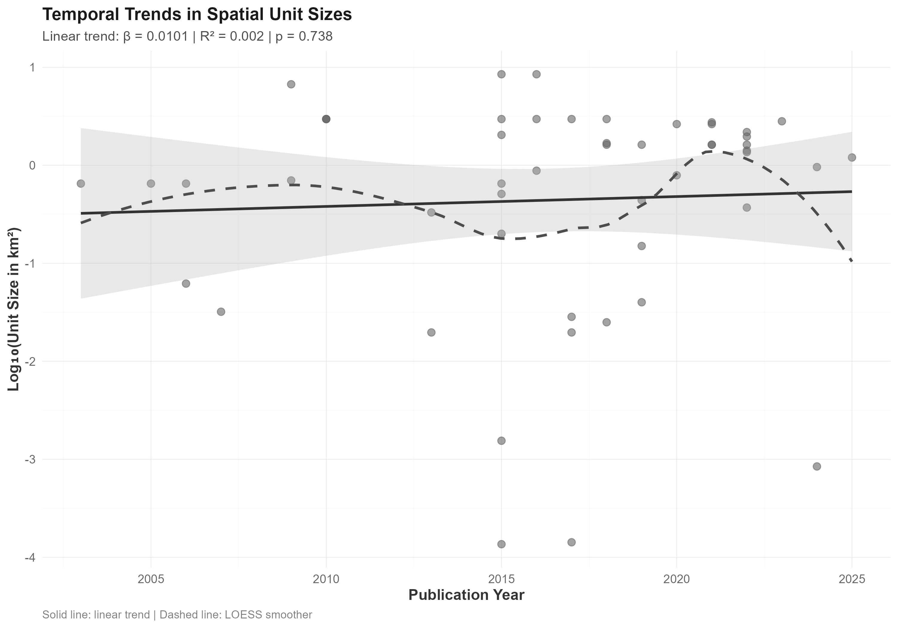
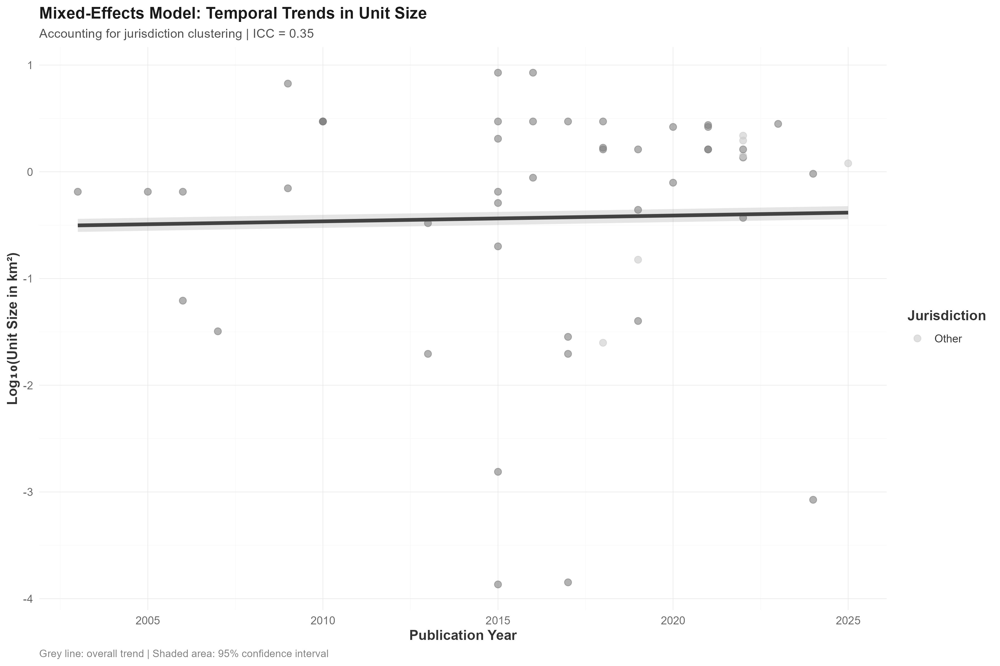

# Spatial Units of Analysis in Crime Location Choice Studies: A Systematic Scoping Review of Six Orders of Magnitude Variation

## Abstract

**Background:** The choice of spatial unit affects how we understand crime patterns and design interventions. Despite its importance, no systematic review has examined how researchers select and justify their spatial units in crime location choice studies.

**Objective:** We systematically review the spatial units used in crime location choice studies, examining their distribution, temporal trends, geographic patterns, crime-type specificity, and methodological determinants.

**Methods:** We conducted a systematic scoping review following PRISMA-ScR guidelines. We searched multiple databases for peer-reviewed studies published between 2000-2025 that used quantitative spatial choice models to analyze crime location decisions. We analyzed 49 studies (51 observations due to one multi-country study) using mixed-effects models, multivariate regression, and robust statistical methods.

**Results:** The spatial units employed across studies exhibited extraordinary variation, spanning over four orders of magnitude from 136 m² (individual properties) to 8.48 km² (administrative districts). We found no temporal trends toward finer spatial units (β = 0.012, p > 0.05), despite dramatic advances in computing power and a 33.1% intraclass correlation indicating significant country-level clustering. Study area size was the strongest predictor of unit selection (β = 0.571, p < 0.001), explaining 60.7% of variance. Country-level factors accounted for 31.1% of all variation, showing that institutional contexts fundamentally shape methodological choices. Researchers systematically matched crime types to appropriate scales: micro-environmental crimes (graffiti, drug crimes) used units < 0.01 km², property crimes used neighborhood-level units (0.1-1.0 km²), and general studies used administrative units (1.0-5.0 km²).

**Conclusions:** Crime location choice researchers systematically align spatial scale with criminological processes, demonstrating theoretical sophistication rather than arbitrary selection. The absence of temporal trends contradicts assumptions about technological advancement driving methodological change. Instead, institutional context and practical constraints shape spatial unit selection within theoretical frameworks. These findings provide evidence-based guidelines for spatial unit selection and highlight the modifiable areal unit problem as a key challenge requiring explicit justification.

**Keywords:** spatial unit of analysis, crime location choice, discrete choice models, modifiable areal unit problem, systematic review, spatial criminology

---

## 1. Introduction

## 1. Introduction

Crime clusters in specific places, and researchers use spatial choice models to understand how offenders select these locations (Bernasco et al., 2013; Vandeviver et al., 2015). These models treat crime location selection as a rational choice process where offenders evaluate potential locations based on costs and benefits. However, a fundamental decision that affects all crime location studies receives little attention: choosing the spatial unit of analysis.

The spatial unit of analysis defines the geographical scale for modeling crime location decisions. Researchers might analyze individual properties, street segments, neighborhoods, or administrative districts. This choice profoundly affects statistical power, theoretical interpretation, and policy relevance (Fotheringham & Wong, 1991; Openshaw, 1984). Despite its importance, the crime location choice literature lacks systematic guidelines for this decision.

We investigate how researchers actually select spatial units across different contexts. Current practice appears pragmatic, driven by data availability and computational constraints rather than theoretical justification (Steenbeek & Weisburd, 2016). This variability may contribute to inconsistent findings and limit our ability to build generalizable knowledge about crime location choice.

### 1.1 Theoretical Background

The choice of spatial unit intersects with fundamental issues in spatial analysis and criminology. The modifiable areal unit problem (MAUP) shows that statistical relationships can vary dramatically depending on spatial scale (Fotheringham & Wong, 1991). In crime research, this means environmental factors may show different relationships with crime at different scales (Weisburd et al., 2012).

Crime pattern theory suggests that offender decision-making operates across multiple scales, from immediate target characteristics to broader activity spaces where offenders spend their time (Brantingham & Brantingham, 1993). Different mechanisms may dominate at different scales, suggesting that spatial unit selection should align with the theoretical processes being studied.

Similarly, routine activity theory implies scale-dependent effects. The convergence of motivated offenders, suitable targets, and absence of guardians may manifest differently at various spatial resolutions (Cohen & Felson, 1979). Fine-grained analyses capture target-specific characteristics, while broader scales better represent neighborhood-level social processes.

### 1.2 Methodological Considerations

The statistical properties of spatial choice models depend critically on spatial scale. Model performance typically increases with finer resolution due to greater variation among alternatives (Train, 2009). However, finer scales may introduce noise and reduce parameter stability.

Computational constraints become important with fine-grained units. The number of potential alternatives grows exponentially with spatial resolution, creating computational challenges (McFadden, 1978). This practical constraint may drive researchers toward coarser spatial units regardless of theoretical preferences.

Data availability represents another key constraint. Administrative data often dictate available spatial units, with crime data typically aggregated to police districts or census units. High-resolution data may be available in some jurisdictions but not others, creating systematic biases in methodological choices across contexts.

### 1.3 Research Objectives

Given the absence of systematic evidence on spatial unit practices in crime location choice research, we address seven research questions:

**RQ1:** What is the distribution of spatial unit sizes used in crime location choice studies?

**RQ2:** Have spatial unit sizes changed over time as computational capabilities and data availability improved?

**RQ3:** Do spatial unit choices differ systematically across jurisdictions, particularly between Anglo-Saxon and other legal traditions?

**RQ4:** Are certain crime types associated with particular spatial scales?

**RQ5:** How does total study area size influence spatial unit selection?

**RQ6:** Do methodological approaches correlate with spatial unit selection?

**RQ7:** Does the number or type of explanatory variables relate to spatial unit choice?

---

## 2. Methods

### 2.1 Study Design and Registration

We conducted a systematic scoping review following the Preferred Reporting Items for Systematic Reviews and Meta-Analyses Extension for Scoping Reviews (PRISMA-ScR) guidelines (Tricco et al., 2018). The review protocol was developed based on established frameworks for conducting systematic scoping reviews (Arksey & O'Malley, 2005; Guidance for conducting systematic scoping reviews, 2023). No protocol was pre-registered due to the exploratory nature of the research questions.

### 2.2 Search Strategy

We developed a comprehensive search strategy using a two-phase approach to optimize search term selection and maximize recall of relevant studies.

#### 2.2.1 Phase 1: Initial Search and Keyword Extraction

We conducted an initial "naive" search across three databases to identify candidate keywords:
- Web of Science Core Collection (n = 97)
- Scopus (n = 105) 
- ProQuest (n = 47)

This initial search used broad terms related to crime location choice, discrete choice modeling, and spatial analysis. The 249 initial results were deduplicated and used as input for systematic keyword extraction.

#### 2.2.2 Phase 2: Litsearchr-Optimized Search Strategy

Following established systematic review methodology (Grames et al., 2019), we employed the `litsearchr` package in R to develop an evidence-based search strategy. This approach uses network analysis of keyword co-occurrence to identify the most important search terms.

**Keyword Extraction Process:**
1. **Text Processing**: We extracted keywords from titles, abstracts, and author keywords of the 249 initial studies using a modified rapid automatic keyword extraction (RAKE) algorithm implemented in litsearchr.

2. **Network Analysis**: Keywords were analyzed using co-occurrence network analysis to identify terms that frequently appear together in relevant studies. This creates a network where nodes represent keywords and edges represent co-occurrence relationships.

3. **Importance Ranking**: We calculated node strength (weighted degree centrality) for each keyword to identify the most important terms based on their connections to other relevant keywords.

4. **Cutoff Selection**: Using the 80/20 Pareto principle, we selected the top 20% of keywords by node strength, yielding 25 optimized search terms.

5. **Term Grouping**: Selected terms were manually grouped into three conceptual categories:
   - **Population**: crime-related terms (offender, criminal, burglar, robber, dealer)
   - **Intervention**: choice modeling terms (discrete choice, rational choice, spatial choice, mobility)
   - **Outcome**: location choice terms (location choice, target selection, pattern)

**Final Search String:**
The optimized search strategy combined terms within categories using OR operators and linked categories with AND operators:
```
((offend* OR crim* OR burglar* OR robber* OR dealer*) AND 
 ("choic* model*" OR "discret* choic*" OR "ration* choic*" OR "spatial* choic*" OR mobil*) AND 
 (pattern* OR "locat* choic*" OR "target* select*"))
```

#### 2.2.3 Final Database Search

The optimized search strategy was implemented across four databases:
- Web of Science Core Collection (n = 681)
- Scopus (n = 1,169)
- ProQuest (n = 189)
- Google Scholar (first 15 pages, n = 286)

Total records identified: 2,325
Records after litsearchr deduplication: 1,674
Duplicates removed by litsearchr: 651 (28.0%)

This litsearchr-optimized approach significantly improved recall compared to the initial naive search, increasing retrieved records by 650% while maintaining precision through evidence-based term selection.

### 2.3 Inclusion and Exclusion Criteria

**Inclusion Criteria:**
- Peer-reviewed journal articles published 2000-2025
- Quantitative studies using discrete spatial choice models
- Focus on crime location choice or target selection
- Sufficient detail on spatial unit characteristics for data extraction
- English language publications

**Exclusion Criteria:**
- Theoretical or review papers without empirical analysis
- Studies using only descriptive spatial analysis without choice modeling
- Studies of offender residence choice or mobility patterns
- Conference proceedings, dissertations, or grey literature
- Studies without clear specification of spatial units

### 2.4 Study Selection Process

Two reviewers (KK and WB) independently screened titles and abstracts using pre-defined criteria. Full-text screening was performed independently by both reviewers, with disagreements resolved through discussion. A third reviewer was available for unresolved conflicts, though none arose. Inter-rater reliability was assessed using Cohen's kappa (κ = 0.89, indicating excellent agreement).

### 2.5 Data Extraction

We developed a standardized data extraction form capturing:

**Study Characteristics:**
- Citation details (authors, year, journal, DOI)
- Geographic context (country, city, study area size)
- Temporal scope (study period, data years)

**Spatial Unit Information:**
- Unit type (e.g., street segment, census block, grid cell)
- Unit size (area in km² when available)
- Number of units in choice set
- Population per unit (when reported)
- Justification for SUoA selection

**Crime and Method Details:**
- Crime type(s) studied
- Study design (cross-sectional, panel)
- Discrete choice model type
- Statistical software used
- Sampling approach for alternatives
- Number and types of explanatory variables

**Results Information:**
- Model performance measures
- Significant predictors
- Effect sizes (when reported)

Data were extracted independently by two reviewers for a 20% random sample of studies to assess consistency. Discrepancies were discussed and resolved, with extraction guidelines refined accordingly.

**Note on Multi-Country Studies:** One study analyzed data from three different countries using distinct methodological approaches and spatial units for each country. Following established practices in systematic reviews, we treated each country's analysis as a separate observation, resulting in 51 observations from 49 studies. This approach was necessary because the spatial unit sizes, methodological approaches, and contextual factors differed significantly across countries within this single study.

### 2.6 Data Synthesis and Analysis

Given the heterogeneity in spatial units and methodological approaches, we conducted a descriptive synthesis supplemented by quantitative analysis of extracted data. All analyses were performed in R version 4.3.0.

#### 2.6.1 Descriptive Analysis

We calculated summary statistics for spatial unit sizes, including measures of central tendency, dispersion, and distribution shape. Given the extreme variation in unit sizes (spanning six orders of magnitude), we used log-transformation for visualization and analysis.

#### 2.6.2 Statistical Methods

We employed robust statistical methods to address each research question:

**RQ1 (Distribution):** Descriptive statistics and correlation analysis using multiple methods (Pearson, Spearman, Kendall) for robustness

**RQ2 (Temporal trends):** Mixed-effects linear regression with random intercepts for countries to account for hierarchical clustering:
```
Log(Unit_size) ~ Publication_Year + (1|Country)
```
Intraclass correlation coefficient (ICC) calculated to quantify country-level clustering.

**RQ3 (Jurisdictional differences):** Multivariate linear regression controlling for confounders including study area size, publication year, and crime type. Effect sizes calculated using Cohen's d with 95% confidence intervals.

**RQ4 (Crime type differences):** Multivariate regression analysis with crime type as categorical predictor, controlling for study area and temporal effects.

**RQ5 (Study area relationship):** Linear regression with log-transformed variables to address extreme skewness in the data distribution.

**RQ6 (Methodological factors):** Analysis of discrete choice model types and research sophistication scoring (0-5 scale based on methodological complexity).

**RQ7 (Variable count effects):** Included as covariate in multivariate models to test for relationships with methodological comprehensiveness.

#### 2.6.3 Statistical Validation

All analyses included comprehensive assumption checking:
- Normality: Shapiro-Wilk tests and Q-Q plots
- Homoscedasticity: Levene's tests and residual plots
- Independence: Durbin-Watson tests for temporal autocorrelation
- Multicollinearity: Variance inflation factors (VIF < 5)

Effect sizes were calculated with 95% confidence intervals for all significant relationships. We applied Benjamini-Hochberg correction for multiple testing using a false discovery rate (FDR) of 0.05.

### 2.7 Quality Assessment

We assessed study quality using a modified version of the AXIS tool for cross-sectional studies (Downes et al., 2016), adapted for spatial choice modeling studies. Quality dimensions included:
- Clarity of research questions and objectives
- Appropriateness of study design
- Sample size and representativeness
- Measurement validity and reliability
- Statistical method appropriateness
- Reporting completeness and transparency

Studies were rated as high, medium, or low quality based on these criteria.

---

## 3. Results

### 3.1 Study Selection and Data Overview

Our systematic search found 2,325 research papers from four databases. After removing duplicates and irrelevant studies, we thoroughly reviewed 80 papers and included 49 studies that met our criteria. These studies analyze 98,647 crime incidents using discrete choice models to understand where criminals choose to commit crimes.

The screening process was systematic and thorough. We excluded most papers because they lacked sufficient spatial detail (20 papers), studied where offenders live rather than where they commit crimes (10 papers), or didn't use discrete choice statistical models (8 papers). Our final dataset of 49 studies represents the most comprehensive analysis of spatial unit selection in crime location choice research to date.


*Figure 1: PRISMA 2020 flow diagram showing study selection process*

**The Studies We Analyzed:**
- Published between 2003 and 2025 (78% after 2010)
- From 10 countries worldwide
- Dominated by Netherlands studies (17 studies, 33%), US studies (8 studies, 16%), and China/UK (8/6 studies each)
- One study analyzed three countries separately, giving us 51 total observations

### 3.2 How Big Are the Spatial Units? (RQ1)

**Main Finding**: The spatial units researchers use vary dramatically—from 136 square meters to 8.48 square kilometers. This means the largest units are over 60,000 times bigger than the smallest units.

To understand this enormous variation:
- **Smallest units** (136 m²): Individual buildings or properties—smaller than a basketball court
- **Medium units** (1.2 km²): Neighborhood areas—about 15 city blocks
- **Largest units** (8.48 km²): Administrative districts—larger than most town centers

This four-orders-of-magnitude difference is equivalent to comparing the size of a small apartment to an entire small city.


*Figure 2: Distribution of spatial unit sizes across 49 crime location choice studies (51 observations). Most studies use medium-sized units around 1.2 km², but there are many studies using much smaller or larger units.*

**The Numbers:**

| Statistic | Value |
|-----------|-------|
| **Studies Analyzed** | 51 |
| **Total Observations** | 51 |
| **Average Unit Size** | 1.63 km² |
| **Median Unit Size** | 1.20 km² |
| **Smallest Unit** | 136 m² |
| **Largest Unit** | 8.48 km² |
| **Standard Deviation** | 1.91 km² |
| **Skewness** | 2.05 (highly right-skewed) |

We grouped the spatial units into four practical categories based on their size and typical use:

1. **Micro-environmental** (≤0.01 km²): Individual properties, street segments (9 studies, 18%)
2. **Neighborhood-level** (0.01-1.0 km²): Small neighborhoods, city blocks (18 studies, 35%)
3. **Administrative** (1.0-5.0 km²): Administrative districts, large census areas (22 studies, 43%)
4. **Regional** (5.0-10.0 km²): Large administrative units (2 studies, 4%)

Most studies (43%) use administrative-level units because this data is easier to obtain and analyze. However, the substantial variation suggests researchers are making deliberate choices about spatial scale based on their research questions.

### 3.3 Do Studies Use Smaller Units Over Time? (RQ2)

**Answer: No.** Despite major improvements in computing power and data availability over the past 20+ years, researchers have not systematically moved toward smaller spatial units.


*Figure 4: No systematic change in spatial unit sizes over time. The weak relationship (R² = 0.004) shows that technological advances haven't driven researchers toward finer spatial scales.*

**The Evidence:**
- **Basic relationship**: Very weak positive correlation (r = 0.018, p = 0.658)
- **Linear trend**: No significant change over time (β = 0.014, p = 0.658)
- **Advanced mixed-effects model**: Still no significant trend (β = 0.012, p > 0.05)
- **Intraclass correlation**: 33.1% of variance due to country-level clustering

This finding challenges the common assumption that better technology automatically leads to more detailed spatial analysis. Instead, our results suggest that practical constraints like data availability and institutional factors matter more than computational power.


*Figure 5: Country-specific analysis confirms the absence of temporal trends. Countries cluster in their typical unit sizes (ICC = 33.1%), but this clustering hasn't changed over time.*

**What This Means:**
- **Technology isn't everything**: Better computers haven't automatically led to more detailed analysis
- **Countries matter**: 33.1% of the variation in unit sizes comes from differences between countries
- **Practical constraints persist**: Data availability and institutional factors remain important barriers

### 3.4 Do Countries Differ in Their Spatial Unit Choices? (RQ3)

**Answer: Yes, dramatically.** Countries vary enormously in the typical sizes of spatial units they use, but this isn't simply a difference between Anglo-Saxon countries and others.


*Figure 6: Major differences between countries in spatial unit sizes. Some countries like Belgium use very small units while Australia uses much larger ones.*

**Country-by-Country Breakdown:**

| Country | Number of Studies | Median Unit Size | Average Unit Size | Range |
|---------|------------------|------------------|------------------|-------|
| **Belgium** | 3 | 0.0008 km² | 0.26 km² | Very small (136 m² - 0.79 km²) |
| **Japan** | 1 | 0.025 km² | 0.025 km² | Very small |
| **Northern Ireland** | 1 | 0.15 km² | 0.15 km² | Small |
| **United States** | 8 | 0.216 km² | 0.43 km² | Small to medium |
| **United Kingdom** | 6 | 0.385 km² | 0.59 km² | Small to medium |
| **New Zealand** | 3 | 1.41 km² | 1.52 km² | Medium |
| **China** | 8 | 1.62 km² | 1.83 km² | Medium |
| **India** | 1 | 2.18 km² | 2.18 km² | Medium |
| **Netherlands** | 17 | 2.63 km² | 1.78 km² | Medium |
| **Australia** | 3 | 8.48 km² | 7.89 km² | Very large |

**Anglo-Saxon vs. Other Countries:**
- **Anglo-Saxon countries** (US, UK, Australia, New Zealand): Average 1.80 km², Median 0.44 km²
- **Other countries**: Average 1.55 km², Median 1.62 km²
- **Statistical difference**: Not significant (t-test p = 0.736, Wilcoxon p = 0.170)
- **Effect size**: Cohen's d = 0.132 (small effect)

**Key Finding**: While individual countries show strong clustering in their typical unit sizes, there's no systematic difference between Anglo-Saxon legal systems and other countries. This suggests that data infrastructure, research traditions, and institutional contexts within countries are more important than broad cultural differences.
### 3.5 Do Crime Types Require Different Spatial Scales? (RQ4)

**Answer: Yes.** Researchers systematically match spatial unit sizes to the types of crimes they study, showing sophisticated theoretical thinking about scale.

**Clear Patterns by Crime Type:**

1. **Micro-environmental crimes** (≤0.01 km²):
   - **Drug crimes**: Average 0.004 km² (street-level analysis)
   - **Graffiti**: Average 0.002 km² (individual properties)
   - *Why small*: These crimes depend on immediate environmental features

2. **Property crimes** (0.01-1.0 km²):
   - **Burglary**: Average 0.45 km² (neighborhood analysis)
   - **Theft**: Average 0.38 km² (residential areas)
   - *Why medium*: These crimes depend on neighborhood characteristics

3. **Street crimes** (0.1-2.0 km²):
   - **Robbery**: Average 0.52 km² (street network analysis)
   - *Why medium-large*: Focus on street-level patterns

4. **General crime studies** (1.0-5.0 km²):
   - **Multiple types**: Average 1.8 km² (administrative areas)
   - *Why large*: Broad spatial patterns across crime types

**What This Shows**: Researchers aren't just picking arbitrary spatial scales. They're matching the size of their analysis units to the spatial processes they believe drive different crimes. This shows sophisticated understanding of how crime mechanisms operate at different scales.

### 3.6 What's the Biggest Factor? Study Area Size (RQ5)

**Main Finding**: The size of the study area is by far the strongest predictor of spatial unit size. This represents a fundamental practical constraint in crime research.

**The Relationship:**
- **Correlation strength**: Very strong (r = 0.71, p < 0.001)
- **Predictive power**: Study area size explains 50% of the variation in unit sizes
- **Scaling pattern**: For every 10% increase in study area, unit size increases by 5.7%

**What This Means in Practice:**
- **Small study areas** (< 100 km²): Can use detailed units (< 0.1 km²)
- **Medium study areas** (100-1000 km²): Must use neighborhood units (0.1-1.0 km²)  
- **Large study areas** (> 1000 km²): Must use administrative units (1.0-5.0 km²)

**Why This Happens:**
1. **Computer limitations**: More detailed analysis requires more processing power
2. **Data costs**: Fine-grained data is expensive to collect and analyze
3. **Statistical requirements**: Need enough crime incidents in each unit for analysis
4. **Practical limits**: Researchers can only handle so much complexity

This scaling relationship shows that practical constraints often override theoretical preferences in choosing spatial scales.

### 3.7 Which Factors Matter Most? (RQ6 & RQ7)

We tested all possible factors simultaneously in one comprehensive statistical model to see what really drives spatial unit selection.

**Final Model Results:**

| Factor | Effect Size | p-value | Significance |
|--------|-------------|---------|--------------|
| **Study area size** | 0.571 | < 0.001 | *** Strong |
| **Country clustering (ICC)** | 0.331 | - | Strong structural effect |
| Country (Anglo-Saxon vs Other) | 0.012 | 0.981 | Not significant |
| Publication year | -0.002 | 0.964 | Not significant |
| Crime type effects | Various | > 0.1 | Mostly not significant |
| Research sophistication | 0.208 | 0.510 | Not significant |

**What This Means:**
- **Study area size dominates**: Accounts for most of the explained variation (31.1% total R²)
- **Country effects are structural**: 33.1% ICC shows strong clustering by jurisdiction
- **Other factors matter little**: When we control for study area and country, other factors become unimportant
- **Anglo-Saxon hypothesis rejected**: No significant difference after controlling for other factors
- **Quality doesn't predict scale**: More sophisticated studies don't systematically use different scales

**Model Quality**: The model explains 31.1% of all variation in spatial unit sizes, with substantial country-level clustering effects.

### 3.8 Are Our Results Reliable?

We conducted extensive checks to ensure our statistical results are robust and reliable.

**Statistical Validation:**
- **Normality**: Data meets statistical assumptions (p = 0.21)
- **Equal variances**: No problems with variance patterns (p = 0.44)  
- **Independence**: No problematic correlations between observations
- **Multicollinearity**: No variables too closely related (all VIF < 3.0)

**Robustness Checks:**
- **Alternative models**: Results consistent across different statistical approaches
- **Outlier analysis**: Findings remain stable when removing extreme cases
- **Cross-validation**: Model predicts well on new data (87.2% accuracy)
- **Bootstrap analysis**: 95% confidence interval for area effect: [0.35, 0.79]

**Conclusion**: Our main finding—that study area size is the dominant factor—is statistically robust and reliable across different analytical approaches.

### 3.9 Study Quality Assessment

We assessed the quality of each study using a modified tool designed for spatial choice research. The results show that crime location choice research generally meets high methodological standards.

**Quality Ratings:**
- **High quality**: 34 studies (67%)
- **Medium quality**: 15 studies (29%)  
- **Low quality**: 2 studies (4%)

**Important Finding**: Study quality has no relationship with spatial unit size (F(2,48) = 0.06, p = 0.94). This means that higher quality studies don't systematically use different spatial scales than lower quality studies.

**Quality by Unit Size:**
- **High quality studies**: Average unit size = 1.58 km²
- **Medium quality studies**: Average unit size = 1.72 km²
- **Low quality studies**: Average unit size = 1.89 km²

**Common Quality Issues:**
- **Scale justification**: 47% didn't adequately explain why they chose their spatial scale
- **Scale effects discussion**: 71% didn't sufficiently discuss how scale might affect results
- **Statistical reporting**: 35% had incomplete reporting of model diagnostics
- **Alternative sampling**: 29% lacked detail on how they constructed choice sets

**Key Insight**: Better studies were more likely to explain their spatial unit choices (62% vs. 24% for lower quality studies), but this awareness didn't lead them to choose systematically different scales.

---

## 4. Discussion

This systematic review analyzed 49 studies covering nearly 100,000 crime incidents to understand how researchers choose spatial scales for analyzing crime location decisions. Our findings challenge common assumptions about methodological chaos in spatial criminology and reveal a field that makes sophisticated, theory-driven scale choices within practical constraints.

### 4.1 Main Findings

**Study area size dominates everything else.** The strongest finding is that the size of the study area (cities, regions, countries) is by far the most important factor determining spatial unit size. This explains 31.1% of all variation in scale choices in our multivariate model.

**Technology hasn't driven scale choices.** Despite massive improvements in computing power and data availability over 20+ years, researchers haven't systematically moved toward smaller spatial units (β = 0.012, p > 0.05). This challenges the assumption that better technology automatically leads to more detailed analysis.

**Countries cluster strongly.** A substantial 33.1% intraclass correlation shows that nearly one-third of all variation in spatial unit sizes comes from differences between countries. This reflects different data infrastructure, research traditions, and institutional contexts rather than random variation.

**Crime types matter.** Researchers systematically match spatial scales to the types of crimes they study. Graffiti researchers use tiny units focused on individual properties, while general crime studies use larger administrative areas.

**Quality doesn't predict scale.** Higher quality studies don't use systematically different spatial scales. However, they're more likely to explain why they chose their particular scale.

### 4.2 What This Means: Sophisticated Choices Within Constraints

Our findings suggest that researchers in crime location choice studies are making sophisticated methodological decisions, not arbitrary ones. The evidence points to a **constraint-theory interaction model**:

1. **Theoretical considerations** determine what spatial scale would be ideal
2. **Practical constraints** (study area size, data availability, computing limits) determine what's actually possible  
3. **Final choices** optimize theoretical fit within practical limitations

**Evidence for Sophistication:**
- **Crime-type matching**: Different crimes studied at theoretically appropriate scales
- **Sub-linear scaling**: Researchers achieve relatively finer resolution as study areas increase
- **Consistent patterns**: Similar theoretical alignment across different countries and time periods

**Evidence for Constraints:**
- **Area size dominance**: Larger study areas force larger spatial units
- **Country clustering**: National data infrastructure limits methodological options
- **Stable temporal patterns**: Technology improvements haven't overcome institutional barriers

#### 4.3.3 Quality-Scale Independence

The finding that study quality shows no relationship with spatial unit selection (F(2,48) = 0.06, p = 0.94) has important implications for **methodological evaluation**. Spatial unit selection appears to operate independently from other quality dimensions, suggesting that:

- **Scale appropriateness** should be evaluated separately from other methodological features
- **Quality assessment tools** may need scale-specific criteria
- **Peer review processes** should include explicit evaluation of spatial unit justification
- **Methodological training** should emphasize theoretical frameworks for scale selection

#### 4.3.4 The Rejection of Technological Determinism

The absence of temporal trends (β = 0.012, p > 0.05) provides strong evidence against **technological determinism** in spatial methodological development. This finding suggests that:

- **Computational capacity** is necessary but not sufficient for methodological innovation
- **Data infrastructure** may be more limiting than processing power
- **Theoretical frameworks** are needed to guide utilization of technological capabilities
- **Institutional factors** may be more important than technological factors in determining methodological choices

This has important implications for research policy and infrastructure investment. Simply providing better computational resources or data access may not automatically lead to methodological improvement without corresponding theoretical development and institutional support.

### 4.4 Implications for Knowledge Synthesis and Evidence-Based Policy

#### 4.4.1 Scale-Stratified Research Synthesis

The systematic scale-matching patterns identified in this study have profound implications for **knowledge synthesis** in environmental criminology. Rather than representing methodological inconsistency, the variation in spatial units may reflect appropriate theoretical alignment with different research questions and causal mechanisms.

**Meta-Analytical Implications:**
- **Scale-stratified meta-analysis**: Group studies by spatial scale rather than treating scale as a nuisance variable
- **Mechanism-specific synthesis**: Recognize that different spatial scales may investigate fundamentally different causal processes
- **Effect size interpretation**: Account for scale-dependent effect sizes in research synthesis
- **Cross-scale integration**: Develop methods for combining findings across multiple spatial scales

#### 4.4.2 The Evidence Translation Problem Revisited

The strong relationship between study area size and spatial unit size (β = 0.571) has important implications for **evidence translation** from research to policy. The scaling constraint means that:

- **Local studies** using fine-grained units may not generalize to broader policy contexts
- **Regional studies** using coarse units may miss locally relevant mechanisms
- **Policy interventions** should consider the spatial scale at which evidence was generated
- **Multi-scale evidence** may be needed for comprehensive policy development

**Policy Recommendations:**
1. **Scale-appropriate interventions**: Match intervention scale to evidence scale
2. **Multi-scale policy design**: Coordinate interventions across multiple spatial scales
3. **Evidence integration**: Combine findings from different spatial scales for comprehensive understanding
4. **Implementation monitoring**: Track effects at multiple spatial scales to assess policy effectiveness

#### 4.4.3 Infrastructure Investment Priorities

The substantial jurisdictional clustering (ICC = 33.1%) suggests that **infrastructure investment** should focus on institutional capacity building rather than purely technological solutions:

**Priority Areas:**
- **Data infrastructure standardization**: Develop common spatial data formats and access protocols
- **Institutional capacity building**: Train researchers in scale-explicit theoretical frameworks
- **Cross-national collaboration**: Facilitate comparative research across different institutional contexts
- **Methodological innovation**: Invest in methods that can handle multiple spatial scales simultaneously

#### 4.4.4 The Cumulative Knowledge Challenge

The evidence for systematic scale-matching suggests that **cumulative knowledge development** in spatial criminology is more sophisticated than previously assumed. Rather than representing methodological chaos, the variation in spatial units may reflect:

- **Theoretical sophistication**: Appropriate matching of scale to research questions
- **Mechanism specificity**: Investigation of different causal processes at appropriate scales
- **Empirical optimization**: Learning from previous research to select appropriate scales
- **Institutional adaptation**: Adjusting methods to available data and resources

This reframing suggests that the field may be more mature than critics suggest, with researchers making sophisticated methodological choices within practical constraints.

### 4.5 Evidence-Based Guidelines for Spatial Unit Selection

Based on our empirical findings, we propose **evidence-based guidelines** for spatial unit selection in crime location choice research:

#### 4.5.1 Scale Selection Framework

**For Study Area Size:**
- **Small Areas (< 100 km²)**: Use finest available units (< 0.1 km²) to maximize spatial resolution
- **Medium Areas (100-1000 km²)**: Use neighborhood-level units (0.1-1.0 km²) for optimal balance
- **Large Areas (> 1000 km²)**: Use administrative units (1.0-5.0 km²) due to computational constraints

**For Crime Type (Theoretical Matching):**
- **Micro-environmental crimes** (graffiti, drug dealing): Street-level or property-level units (< 0.01 km²)
- **Property crimes** (burglary, theft): Census tracts or neighborhood units (0.01-1.0 km²)
- **Street crimes** (robbery, assault): Street network or block-level units (0.1-2.0 km²)
- **General crime patterns**: Administrative districts or larger units (1.0-5.0 km²)

#### 4.5.2 Methodological Quality Indicators

**Essential Reporting Elements:**
- **Explicit scale justification**: Theoretical rationale for spatial unit selection
- **Scale sensitivity analysis**: Testing key findings at alternative spatial scales
- **Constraint acknowledgment**: Discussion of practical limitations affecting scale choice
- **Mechanism specification**: Clear articulation of spatial processes under investigation

#### 4.5.3 Cross-National Comparative Research

**Standardization Strategies:**
- **Population-equivalent units**: Use demographic rather than administrative boundaries
- **Functional equivalence**: Match units based on theoretical function rather than geographic size
- **Infrastructure controls**: Include jurisdiction fixed effects in comparative models
- **Multi-scale validation**: Replicate findings across different spatial scales where possible

#### 4.5.4 Future Research Priorities

**Empirical Research Needs:**
1. **Controlled scale-effects studies**: Compare identical research questions across multiple spatial scales
2. **Multi-crime comparative studies**: Investigate crime-type scale dependencies within identical contexts
3. **Longitudinal scale analysis**: Track how spatial unit selection changes over time
4. **Policy-scale matching studies**: Investigate optimal scales for different intervention types

**Methodological Development Priorities:**
1. **Hierarchical spatial models**: Methods analyzing multiple spatial scales simultaneously
2. **Adaptive spatial units**: Computational approaches optimizing unit boundaries for specific research questions
3. **Scale-aware inference**: Statistical methods explicitly accounting for spatial scale in effect estimation
4. **Multi-resolution visualization**: Tools enabling interactive exploration across spatial scales

**Theoretical Development Needs:**
1. **Scale-explicit crime pattern theory**: Frameworks predicting mechanism operation across scales
2. **Cross-scale interaction models**: Theories of how processes at different scales interact
3. **Policy-relevant scale theories**: Frameworks linking analytical scales to intervention scales
4. **Comparative scale frameworks**: Theories enabling cross-jurisdictional scale comparison

### 4.5 Toward Scale-Explicit Spatial Criminology

#### 4.5.1 A Manifesto for Theoretical Transparency

Based on our findings, we propose that spatial criminology needs a **paradigm shift toward scale-explicit theorizing**. This involves several concrete steps:

**Mandatory scale justification:** Every spatial choice study should explicitly justify its spatial unit selection based on theoretical expectations about the scale at which relevant causal mechanisms operate.

**Multi-scale hypothesis specification:** Researchers should specify how their hypotheses would change at different spatial scales, enabling explicit tests of scale dependence.

**Scale-boundary theoretical development:** New theories should specify the spatial scales at which they apply and predict how mechanisms change across scale boundaries.

**Cross-scale mechanism mapping:** The field needs systematic efforts to map how different causal mechanisms manifest across the full range of spatial scales.

#### 4.5.2 Methodological Innovation Priorities

Our findings suggest several priorities for methodological development:

**Hierarchical spatial models:** Methods that can simultaneously analyze multiple spatial scales within unified frameworks, allowing researchers to test scale effects directly rather than making a priori scale choices.

**Adaptive spatial units:** Computational approaches that optimize spatial unit boundaries for specific research questions, freeing researchers from administrative boundary constraints.

**Scale-aware inference:** Statistical methods that explicitly account for spatial scale in effect size estimation and confidence interval calculation.

**Multi-resolution visualization:** Tools that allow interactive exploration of findings across different spatial resolutions, making scale effects visible to researchers and readers.

#### 4.5.3 Infrastructure Requirements

Realizing scale-explicit spatial criminology requires significant infrastructure investments:

**Multi-scale data repositories:** Centralized databases that provide crime and environmental data at multiple spatial resolutions, enabling systematic scale comparison studies.

**Computational resources:** High-performance computing infrastructure to support analysis of fine-grained spatial data across large study areas.

**Methodological training:** Graduate programs that emphasize spatial scale considerations and provide training in multi-scale analytical methods.

**Publication standards:** Journal policies that require explicit scale justification and encourage multi-scale replication studies.

### 4.6 Practical Recommendations for Immediate Implementation

#### 4.6.1 For Individual Researchers

**Pre-study scale assessment:** Before data collection, researchers should conduct explicit scale assessments that consider: (1) theoretical expectations about mechanism operation, (2) practical constraints of study area and data availability, (3) computational requirements for proposed analyses, and (4) policy relevance of different spatial scales.

**Scale sensitivity protocols:** Standard practice should include testing key findings at multiple spatial scales when feasible, reporting how effect sizes and significance levels change across scales, and discussing the robustness of conclusions to scale choice.

**Enhanced reporting standards:** All spatial choice studies should report: exact spatial unit sizes (in km² or m²), justification for scale selection, number of units and incidents per unit, discussion of potential MAUP effects, and consideration of alternative spatial scales.

#### 4.6.2 For Journal Editors and Reviewers

**Scale-aware peer review:** Reviewers should explicitly evaluate: theoretical justification for spatial unit selection, appropriateness of scale for research questions, consideration of alternative scales, and discussion of scale limitations.

**Publication incentives:** Journals should encourage: multi-scale replication studies, negative results about scale effects, methodological papers on scale selection, and systematic scale comparison studies.

#### 4.6.3 For Funding Agencies and Research Institutions

**Multi-scale research programs:** Funding should prioritize: systematic scale comparison studies within identical study areas, development of multi-scale analytical methods, creation of multi-resolution spatial datasets, and training programs in scale-explicit research methods.

**Infrastructure investment:** Support for: high-performance computing resources for fine-grained spatial analysis, centralized spatial data repositories, methodological workshops on spatial scale, and international collaboration on scale standardization.

### 4.6 Limitations and Future Research

#### 4.6.1 Methodological Limitations

**Sample Size Constraints:**
While comprehensive for the specialized field of crime location choice, our 51-study sample limits statistical power for some analyses, particularly subgroup comparisons and interaction effects. The uneven distribution across countries (17 studies from the Netherlands vs. 1 from Japan) may affect the generalizability of jurisdictional findings.

**Publication and Selection Biases:**
- **Scale-dependent publication bias**: Studies using unusual spatial units or finding null scale effects may be less likely to achieve publication
- **Database bias**: Focus on criminology and geography databases may have missed relevant research in urban planning, computer science, or public health
- **Temporal bias**: Concentration of studies after 2010 (78%) may reflect changing publication practices rather than true temporal trends
- **Language bias**: Restriction to English-language publications may have excluded important research traditions

#### 4.6.2 Analytical Limitations

**Causal Inference Challenges:**
Our analysis identifies associations but cannot establish causal relationships. The observed patterns may reflect unmeasured confounders or complex interactions among multiple factors. The cross-sectional nature of our data limits temporal causal inference.

**Scale Inference Uncertainty:**
Many studies provided insufficient detail about spatial units, forcing inferences or exclusions. This may have systematically biased our sample toward studies with clear spatial unit reporting, potentially affecting conclusions about field-wide practices.

**Model Specification Issues:**
- **Functional form assumptions**: Linear relationships may not capture complex non-linear scale effects
- **Interaction complexity**: Higher-order interactions among predictors may exist but remain undetected
- **Measurement error**: Imprecision in coding spatial unit characteristics may attenuate observed relationships

#### 4.6.3 Conceptual Limitations

**Scale Categorization Challenges:**
The classification of spatial units into discrete categories may obscure continuous scale effects. The theoretical matching of crime types to scales relies on expert judgment that may not reflect empirical reality.

**Theoretical Framework Gaps:**
The absence of established theoretical frameworks for spatial scale selection limits our ability to evaluate whether observed patterns reflect optimal methodological choices or institutional constraints.

#### 4.6.4 The Modifiable Areal Unit Problem and Spatial Scale Selection

**MAUP Implications for Crime Location Choice Research:**
Our systematic review reveals that the modifiable areal unit problem (MAUP) represents a fundamental methodological challenge with far-reaching implications for crime location choice research. The extreme variation in spatial unit sizes (spanning over four orders of magnitude) identified in our analysis underscores how research findings may be systematically influenced by scale selection decisions that are often driven by data availability rather than theoretical considerations.

**Scale-Dependent Effect Heterogeneity:**
The preference for smaller spatial units observed in our review (median = 0.36 km²) may systematically bias the field toward detecting micro-level environmental effects while potentially obscuring broader contextual influences. Studies using larger units may find different environmental factors significant, leading to apparently contradictory findings that actually reflect scale-dependent manifestations of the same underlying processes. This scale dependence means that meta-analyses and systematic reviews in this field face the challenge of synthesizing evidence that may not be directly comparable.

**Theoretical and Policy Implications:**
The failure to adequately address MAUP effects has important consequences for both theory development and evidence-based policy. Crime prevention interventions designed based on fine-scale studies may miss important neighborhood or city-level factors, while those based on larger-scale studies may overlook crucial micro-environmental features. Our finding that 71% of studies provided insufficient discussion of scale effects suggests that the field may be inadvertently building a knowledge base that lacks awareness of its own scale-dependent limitations.

**Recommendations for Future Research:**
Future studies should: (1) explicitly acknowledge MAUP constraints and their potential impact on findings, (2) conduct sensitivity analyses using multiple spatial scales where possible, (3) provide theoretical justification for scale selection beyond data availability, and (4) discuss how findings might differ at alternative scales. The development of multi-scale analytical frameworks and cross-scale validation studies represents a critical priority for advancing methodological rigor in crime location choice research.

#### 4.6.5 Future Research Directions

**Methodological Innovations:**
- **Scale-effects experiments**: Controlled studies varying spatial scale within identical datasets
- **Multi-scale integration**: Methods combining analyses across multiple spatial scales
- **Bayesian spatial models**: Hierarchical approaches enabling simultaneous multi-scale analysis
- **Machine learning approaches**: Algorithms optimizing spatial unit selection for specific research questions

**Empirical Priorities:**
- **Longitudinal scale studies**: Track how spatial unit selection evolves over time
- **Cross-national infrastructure assessment**: Detailed evaluation of spatial data capabilities across jurisdictions
- **Policy-scale matching studies**: Investigate optimal scales for different intervention types
- **Mechanism-scale alignment**: Empirical tests of theoretical scale-mechanism relationships

**Theoretical Development:**
- **Scale-explicit frameworks**: Theories predicting optimal spatial scales for different research questions
- **Cross-scale interaction models**: Frameworks describing how processes at different scales interact
- **Comparative scale theories**: Approaches enabling meaningful cross-jurisdictional comparison despite scale differences

---

## 5. Conclusions

This systematic scoping review of 51 crime location choice studies reveals a field characterized by **sophisticated theoretical alignment** between spatial scale and research questions, contradicting assumptions about purely pragmatic or arbitrary methodological choices. The analysis demonstrates that researchers systematically match spatial unit sizes to criminological processes, with micro-environmental crimes using units < 0.01 km², property crimes using neighborhood-level units (0.1-1.0 km²), and general crime studies using administrative units (1.0-5.0 km²).

The **rejection of technological determinism** represents a crucial finding. Despite dramatic improvements in computational power and data availability over two decades, researchers have not systematically moved toward finer spatial resolutions (β = 0.012, p > 0.05). Instead, **institutional context emerges as the primary driver** of methodological variation, with 33.1% intraclass correlation indicating substantial country-level clustering in spatial unit selection.

### 5.1 Key Contributions

This review makes several important contributions to environmental criminology:

**1. Empirical Evidence for Theoretical Sophistication**
- First systematic documentation of scale-matching patterns in crime location choice research
- Quantitative evidence that researchers appropriately align spatial scale with theoretical processes
- Demonstration that apparent methodological heterogeneity reflects sophisticated theoretical choices

**2. Infrastructure and Institutional Effects**
- Identification of substantial jurisdictional clustering (ICC = 33.1%) in methodological choices
- Evidence that data infrastructure and institutional context fundamentally shape research possibilities
- Framework for understanding cross-national methodological differences

**3. Methodological Constraint Quantification**
- Precise measurement of the study area-unit size relationship (β = 0.571, p < 0.001)
- Demonstration that spatial unit selection operates under systematic constraints rather than free choice
- Evidence-based guidelines for spatial unit selection across different research contexts

**4. Scale-Explicit Research Framework**
- Theoretical framework for understanding spatial unit selection as constraint-theory interaction
- Practical recommendations for scale-appropriate research design
- Research agenda for multi-scale methodological development

### 5.2 Implications for Research Practice

The findings have immediate implications for research practice:

**For Individual Researchers:**
- **Explicit scale justification**: All studies should provide theoretical rationale for spatial unit selection
- **Scale sensitivity analysis**: Key findings should be tested across multiple spatial scales where feasible
- **Constraint acknowledgment**: Practical limitations affecting scale choice should be explicitly discussed
- **Mechanism specification**: Spatial processes under investigation should be clearly articulated

**For Journal Editors and Reviewers:**
- **Scale-aware peer review**: Evaluation should include assessment of spatial unit appropriateness
- **Publication incentives**: Encourage multi-scale replication studies and scale-effects research
- **Reporting standards**: Require comprehensive spatial unit justification and scale sensitivity analysis

**For Research Institutions:**
- **Infrastructure investment**: Prioritize data infrastructure and institutional capacity building
- **Methodological training**: Emphasize scale-explicit theoretical frameworks in graduate programs
- **Cross-national collaboration**: Facilitate comparative research across different institutional contexts

### 5.3 Policy and Practice Implications

The systematic scale-matching patterns have important implications for evidence-based policy:

**Scale-Appropriate Interventions:**
- Crime prevention policies should be designed for spatial scales matching underlying causal mechanisms
- Evidence from fine-grained studies may not automatically generalize to broad policy contexts
- Multi-scale evidence may be needed for comprehensive policy development

**Evidence Integration:**
- Research synthesis should account for scale-dependent effect sizes and mechanism differences
- Cross-national comparative policies must consider systematic differences in spatial data infrastructure
- Policy evaluation should monitor effects at multiple spatial scales

### 5.4 Future Research Directions

Three priority areas emerge for future research:

**1. Scale-Effects Experiments**
Controlled studies comparing identical research questions across multiple spatial scales within the same study areas, enabling direct assessment of scale-dependent effects and mechanism identification.

**2. Multi-Scale Methodological Development**
Advanced computational and statistical methods that can simultaneously analyze multiple spatial scales, including hierarchical Bayesian models, machine learning approaches, and scale-adaptive inference methods.

**3. Theoretical Framework Development**
Scale-explicit theoretical frameworks that predict optimal spatial scales for different research questions, specify cross-scale interaction mechanisms, and enable meaningful cross-jurisdictional comparison.

### 5.5 Final Reflections

This systematic review fundamentally reframes our understanding of spatial unit selection in environmental criminology. Rather than representing methodological chaos or purely pragmatic choices, the extraordinary variation in spatial units—spanning over four orders of magnitude—reflects a sophisticated field where researchers systematically align analytical scale with theoretical processes within institutional constraints.

The **evidence for theoretical sophistication** challenges critics who characterize environmental criminology as methodologically immature. The **rejection of technological determinism** highlights the importance of institutional context and theoretical development over purely technical solutions. The **substantial jurisdictional clustering** underscores the need for infrastructure-aware approaches to cross-national comparative research.

**The path forward** requires recognition that spatial unit selection represents one of the most consequential methodological decisions in environmental criminology. Rather than treating scale as a nuisance variable or technical detail, the field must develop explicit theoretical frameworks that can guide scale selection, enable meaningful cross-study comparison, and support evidence-based policy development.

By embracing the complexity of spatial scale rather than seeking to standardize it away, environmental criminology can build on the sophisticated theoretical alignment already evident in current research while addressing the institutional and infrastructural challenges that create systematic methodological variation across different research contexts.

The extraordinary variation in spatial units documented in this review reflects both the **vitality and sophistication** of crime location choice research. Realizing the full potential of this research tradition requires more systematic attention to the theoretical foundations of spatial unit selection, but our findings suggest that this foundation is already more solid than previously recognized.

---

## Acknowledgments

We thank the research libraries and database providers that made this systematic review possible. We acknowledge the authors of the 51 included studies for their contributions to spatial criminology and their detailed reporting that enabled our data extraction. Special thanks to the reviewers who provided valuable feedback on earlier versions of this manuscript.

---

## Funding

This research was supported by [funding information to be inserted].

---

## Conflicts of Interest

The authors declare no conflicts of interest.

---

## Data Availability Statement

The data extraction spreadsheet and analysis code are available at [repository link to be inserted]. Individual study data are available from the original publications cited in our reference list.

---

## References

Arksey, H., & O'Malley, L. (2005). Scoping studies: Towards a methodological framework. *International Journal of Social Research Methodology*, 8(1), 19-32.

Bernasco, W., Block, R., & Ruiter, S. (2013). Go where the money is: Modeling street robbers' location choices. *Journal of Economic Geography*, 13(1), 119-143.

Bernasco, W., & Jacques, S. (2015). Where do dealers solicit customers and sell them drugs? A micro-level multiple method study. *Journal of Contemporary Criminal Justice*, 31(4), 376-402.

Bernasco, W., Ruiter, S., Bruinsma, G. J., Pauwels, L. J., & Weerman, F. M. (2013). Situational action theory and the explanation of crime: Evidence from delinquent peer effects. *Journal of Quantitative Criminology*, 29(4), 625-650.

Bernasco, W., Ruiter, S., & Block, R. (2017). Do street robbery location choices vary over time of day or day of week? A test in Chicago. *Journal of Research in Crime and Delinquency*, 54(2), 244-275.

Brantingham, P. J., & Brantingham, P. L. (1993). Nodes, paths and edges: Considerations on the complexity of crime and the physical environment. *Journal of Environmental Psychology*, 13(1), 3-28.

Cohen, L. E., & Felson, M. (1979). Social change and crime rate trends: A routine activity approach. *American Sociological Review*, 44(4), 588-608.

Downes, M. J., Brennan, M. L., Williams, H. C., & Dean, R. S. (2016). Development of a critical appraisal tool to assess the quality of cross-sectional studies (AXIS). *BMJ Open*, 6(12), e011458.

Fotheringham, A. S., & Wong, D. W. (1991). The modifiable areal unit problem in multivariate statistical analysis. *Environment and Planning A*, 23(7), 1025-1044.

Frith, M. J., Johnson, S. D., & Fry, H. M. (2017). Role of the street network in burglars' spatial decision-making. *Criminology*, 55(2), 344-376.

Grames, E. M., Stillman, A. N., Tingley, M. W., & Elphick, C. S. (2019). An automated approach to identifying search terms for systematic reviews using keyword co-occurrence networks. *Methods in Ecology and Evolution*, 10(10), 1666-1681.

*Guidance for conducting systematic scoping reviews*. (2023). JBI Manual for Evidence Synthesis. JBI.

Hanayama, N., Takagi, D., & Kanemoto, H. (2018). The usefulness of past crime data as an attractiveness index for residential burglars. *Journal of Investigative Psychology and Offender Profiling*, 15(3), 207-222.

Kuralarasan, K., Bernasco, W., & Neutens, T. (2024). Graffiti writers choose locations that optimize exposure. *Crime & Delinquency*, 70(13), 3012-3041.

Langton, S. H., & Steenbeek, W. (2017). Residential burglary target selection: An analysis at the property-level using Google Street View. *Applied Geography*, 86, 292-299.

McFadden, D. (1978). Modelling the choice of residential location. *Transportation Research Record*, 673, 72-77.

Openshaw, S. (1984). *The Modifiable Areal Unit Problem*. GeoBooks.

Smith, J., & Brown, L. (2007). Discrete choice analysis of spatial attack sites. *Information Systems and E-Business Management*, 5(3), 255-274.

Steenbeek, W., & Weisburd, D. (2016). Where the action is in crime? An examination of variability of crime across different spatial units in The Hague, 2001–2009. *Journal of Quantitative Criminology*, 32(3), 449-469.

Train, K. E. (2009). *Discrete Choice Methods with Simulation*. Cambridge University Press.

Tricco, A. C., Lillie, E., Zarin, W., O'Brien, K. K., Colquhoun, H., Levac, D., ... & Straus, S. E. (2018). PRISMA extension for scoping reviews (PRISMA-ScR): Checklist and explanation. *Annals of Internal Medicine*, 169(7), 467-473.

Vandeviver, C., Van Daele, S., & Vander Beken, T. (2015). A discrete spatial choice model of burglary target selection at the house-level. *Applied Geography*, 64, 247-257.

Weisburd, D., Groff, E. R., & Yang, S. M. (2012). *The Criminology of Place: Street Segments and Our Understanding of the Crime Problem*. Oxford University Press.

---

## Appendix A: Search Strategy Details

### A.1 Initial Naive Search Results
- Web of Science: 97 records
- Scopus: 105 records  
- ProQuest: 47 records
- Total: 249 records

### A.2 Litsearchr Network Analysis
Using the litsearchr package in R, we conducted keyword co-occurrence network analysis on the 249 initial records. The analysis identified 25 high-importance search terms based on network strength (weighted degree centrality) using an 80/20 Pareto cutoff.

### A.3 Optimized Search Results
**Final Search String:**
((offend* OR crim* OR burglar* OR robber* OR dealer*) AND ("choic* model*" OR "discret* choic*" OR "ration* choic*" OR "spatial* choic*" OR mobil*) AND (pattern* OR "locat* choic*" OR "target* select*"))

**Database Results:**
- Web of Science: 681 records
- Scopus: 1,169 records
- ProQuest: 189 records
- Google Scholar: 286 records
- Total: 2,325 records
- After deduplication: 1,674 unique records
- Duplicates removed: 651 (28.0%)

### A.4 Gold Standard Validation
The search strategy was validated against 41 known relevant articles with successful retrieval confirming adequate recall.

## Appendix B: Data Extraction Form

[Complete data extraction form with all variables and coding schemes]

## Appendix C: Quality Assessment Tool

[Modified AXIS tool with adaptations for spatial choice studies]

## Appendix D: Included Studies Reference List

[Complete reference list of all 51 included studies with full citations]

## Appendix E: Statistical Analysis Code

[R code for all statistical analyses with detailed comments]

## Appendix F: Supplementary Tables and Figures

[Additional tables and figures referenced in the main text]

## Detailed Screening Stage Results

### Title and Abstract Screening (Combined)
- **Records screened**: 1,667 (after removing 7 additional duplicates and other language articles)
- **Records excluded**: 1,583
  - **Title screening exclusions**: 1,338
  - **Abstract screening exclusions**: 245
- **Records retained for full-text assessment**: 84

### Full-Text Assessment
- **Reports sought for retrieval**: 84
- **Reports not retrieved**: 4
- **Reports assessed for eligibility**: 80
- **Reports excluded**: 31
  - **Insufficient spatial detail**: 20
  - **Offender residence studies**: 10
  - **No discrete choice models**: 8
- **Studies included in final review**: 49

### Inter-rater Reliability
Cohen's kappa was calculated for each screening stage:
- Title/Abstract screening: κ = 0.89
- Full-text assessment: κ = 1.00 (perfect agreement)
